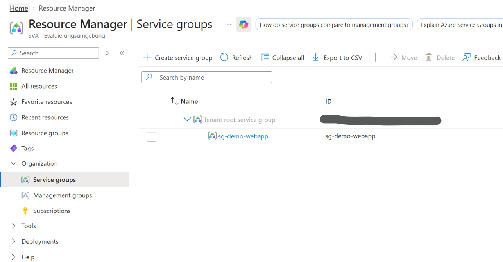
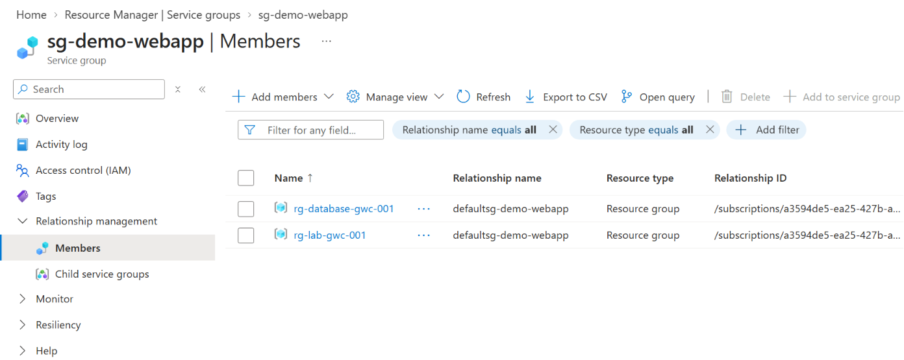

# Azure Service Groups

## Overview

Azure Service Groups provide a logical way to group Azure resources that belong to the same **application or service**.

Unlike Resource Groups, the resources are not moved into a new container. Instead, Service Groups create a logical view across existing Azure resources and Resource Groups.

This is particularly useful when the components of an application are distributed across multiple Resource Groups or Subscriptions.

---

## Service Group Hierarchy

Service Groups are part of Azure Resource Manager and provide their own hierarchical structure.

At the top of the hierarchy is the:

**Tenant root service group**

Custom Service Groups can be created underneath it.



Service Groups can also contain child Service Groups, allowing services to be represented hierarchically.

---

## Members and Relationships

Resources or Resource Groups can be added to a Service Group as **Members**.

The association between a Service Group and its members is represented by a **Relationship**.

The important point is that adding a resource to a Service Group does **not** move or reorganize the actual Azure resource.

The resource remains in its:

- original Resource Group
- original Subscription
- existing Azure Resource Manager structure

The Service Group provides an additional logical representation of how resources belong together from an application or service perspective.

---

## Example

In this lab, the following Service Group was created:

```text
sg-demo-webapp
```

Two Resource Groups were added as members:

```text
sg-demo-webapp
│
├── rg-database-gwc-001
│
└── rg-lab-gwc-001
```



Although both Resource Groups remain independent Azure Resource Manager resources, the Service Group represents them as components of the same logical service.

---

## Available Capabilities

Service Groups integrate with several Azure management capabilities, including:

- Access Control (IAM) / RBAC
- Tags
- Activity Log
- Relationship Management
- Monitoring
- Resiliency

This allows a service to be viewed and managed from a service-oriented perspective rather than only through the underlying Resource Group and Subscription structure.

---

## Service Groups vs. Resource Groups vs. Management Groups

The three concepts serve different purposes.

| Concept | Primary Purpose |
|---|---|
| **Management Group** | Organize and govern Azure Subscriptions |
| **Resource Group** | Group Azure resources and manage their lifecycle |
| **Service Group** | Logically represent resources that together form an application or service |

Service Groups therefore **do not replace Management Groups or Resource Groups**.

They complement the existing Azure hierarchy by adding another logical layer focused on applications and services.

---

## Key Takeaways

- Service Groups logically group resources belonging to the same application or service.
- Resources and Resource Groups can become members of a Service Group.
- Membership is represented through Relationships.
- Existing resources are not moved.
- Service Groups can span organizational boundaries such as Resource Groups and Subscriptions.
- Service Groups provide their own hierarchy below the Tenant root service group.
- They complement rather than replace Resource Groups and Management Groups.
