# Microsoft Entra Application Proxy: Securing Azure-Hosted Applications for Mobile Access

## Scenario

A line-of-business application server was running as an Azure IaaS VM, accessed by roughly **1,000 iOS devices** connecting over the customer's **guest Wi-Fi**. Devices were managed via **Intune** (device certificates), and users authenticated with **Microsoft Entra ID** identities (Entra ID P1 licensed).

The requirement: give mobile app users reliable access to the backend server without exposing it directly to the internet and without bridging the guest Wi-Fi network into the corporate/Azure network.

## Architecture Decision

Three options were evaluated:

| Option | Description | Verdict |
|---|---|---|
| **Public exposure** | Expose the VM directly to the internet (optionally behind Azure Application Gateway as reverse proxy) | Rejected — an openly reachable backend was not the preferred posture for this workload |
| **Site-to-site / VPN tunnel** | Connect the guest Wi-Fi network to the Azure VNet | Rejected — the guest Wi-Fi is intentionally isolated from corporate/production networks; bridging it would undermine that segmentation |
| **Microsoft Entra Application Proxy** | Publish the application through Entra ID without opening any inbound port on the VM | **Selected** |

Application Proxy fit the requirement well because:

- No inbound port needs to be opened on the VM or in the VNet — the connector establishes an **outbound** connection only.
- No network-level trust relationship between the guest Wi-Fi and the Azure environment is required — identity becomes the trust boundary instead of the network.
- The organization already had **Entra ID P1** licensing (required for Application Proxy) and existing Entra identities/Intune enrollment to build on.

### How Application Proxy Works

Microsoft Entra Application Proxy publishes on-premises or IaaS-hosted web applications to remote users without a VPN. A lightweight **connector**, installed on a server with outbound access to the target application, maintains a persistent outbound connection to the Application Proxy cloud service. Client requests are relayed through that connection rather than through an inbound firewall rule.

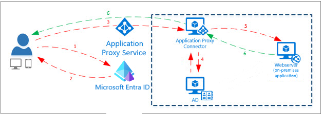

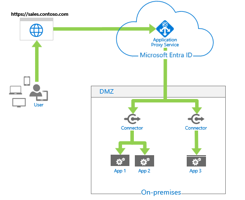

The detailed authentication flow shows the credential and token exchange step by step:

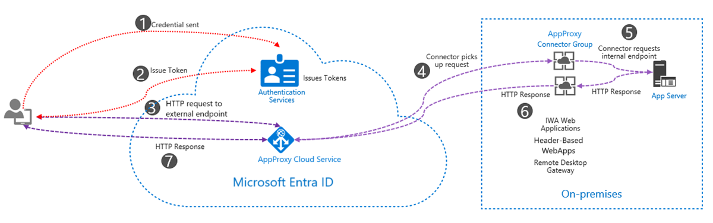

Application Proxy is one part of a broader model where Entra ID acts as the identity plane for on-premises, IaaS, and SaaS applications alike:

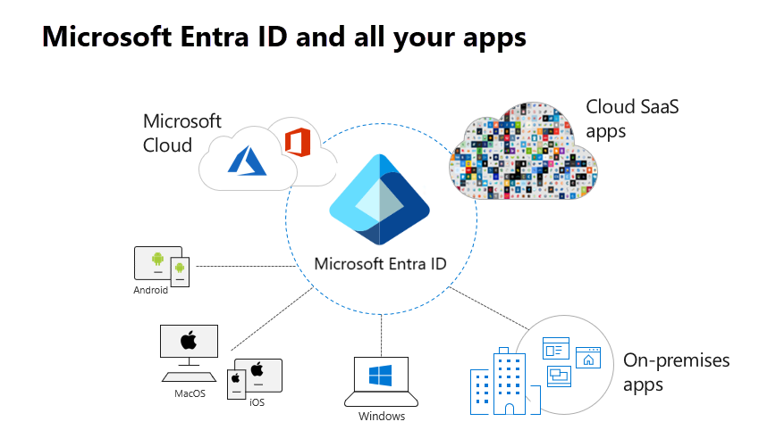

## Setup

### 1. Publish the application

An Enterprise Application is created via **"Add your own on-premises application"** in the Entra App Gallery, specifying the app's internal and external URLs.

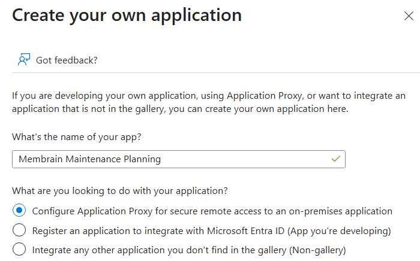

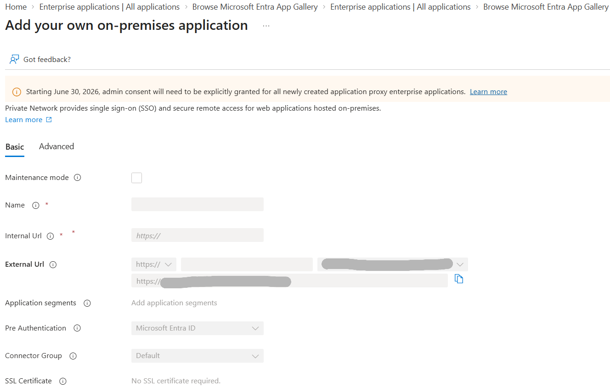

### 2. Install the connector

Application Proxy requires at least one **Private Network connector** installed on a Windows Server with outbound connectivity to the target VM. In this setup, a **new dedicated connector VM** was provisioned (Windows Server), and the connector agent was installed there.

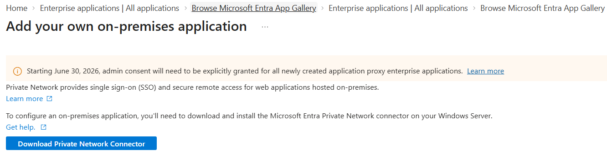

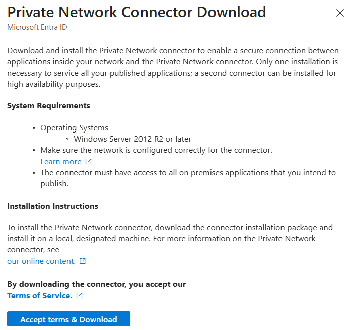

Currently a **single connector** is deployed while the customer runs pilot testing. For production, a second connector in the same Connector Group is recommended for high availability — a single connector is a single point of failure for that published application.

### 3. Configure Basic and Advanced settings

Internal URL, External URL, Connector Group, and Pre-Authentication mode are configured on the Basic tab:

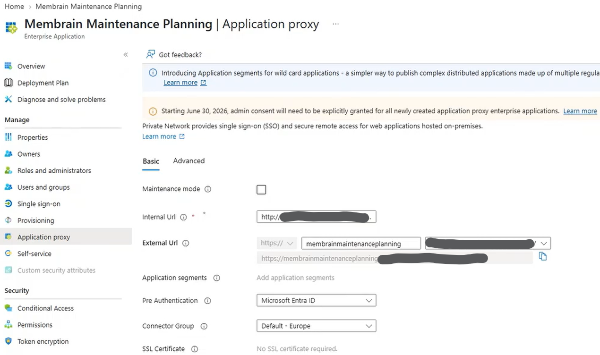

Advanced settings (backend timeout, cookie handling, URL translation, backend SSL certificate validation) are left mostly at their defaults for this application:

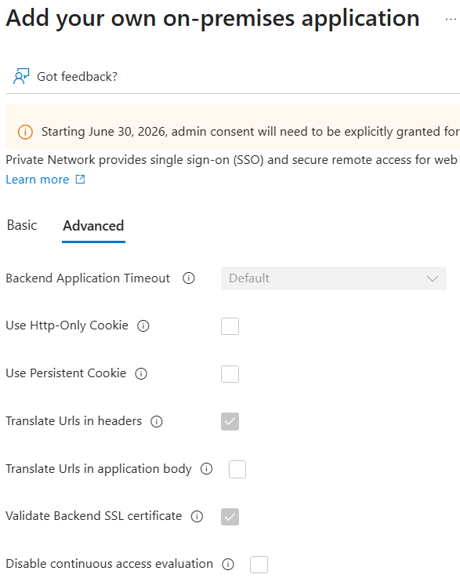

### 4. Pre-Authentication mode: Passthrough vs. Microsoft Entra ID

This is the key configuration decision for this scenario. Application Proxy supports two Pre-Authentication modes:

- **Microsoft Entra ID (Pre-Authentication):** Entra ID authenticates the user *before* any request reaches the connector/backend. The strongest posture, but it means Entra ID handles the sign-in, independent of whatever auth mechanism the application itself implements.
- **Passthrough:** Application Proxy forwards the request straight to the backend without pre-authenticating at the proxy layer. Authentication is left entirely to the application.

The mobile application in this scenario already implements its **own native OpenID Connect SSO against Entra ID**. Since the app performs the OIDC sign-in itself, adding Entra Pre-Authentication in front of it would mean authenticating twice against the same identity provider — redundant, and potentially incompatible with the app's own auth flow. **Passthrough** was therefore selected for the current pilot, letting the application's built-in Entra OIDC SSO handle authentication end-to-end while Application Proxy provides the secure, no-inbound-port connectivity path.

> This is a useful general rule of thumb: Entra Pre-Authentication is the right default for apps with no native modern auth support (legacy IWA apps, header-based apps). For apps that already speak OIDC/SAML against the same tenant, Passthrough usually avoids a redundant second authentication step.

### 5. API permissions and Conditional Access

Two additional controls were layered on top of the base setup by other parts of the deployment (not the focus of this write-up, but part of the same rollout):

- **API permissions / admin consent** for the app registration (Microsoft Graph `User.Read`, delegated):

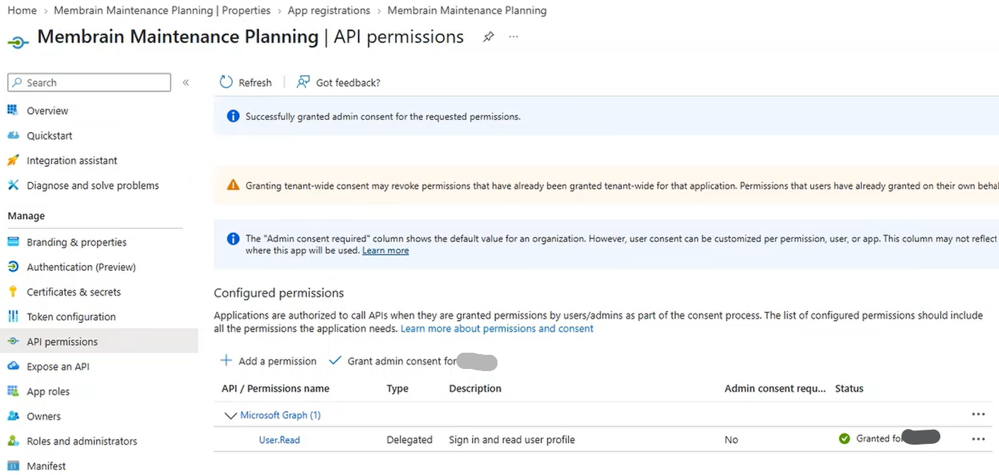

- A **Conditional Access policy** targeting the published cloud app, validated with the "What If" tool before rollout:

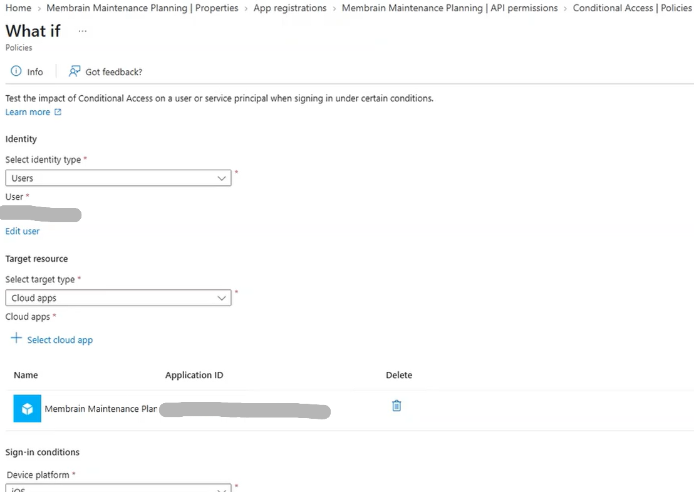

## Key Takeaways

- Application Proxy is a solid fit whenever the goal is "reach a backend from outside without opening an inbound port or bridging networks" — the trust boundary shifts from network location to identity.
- A VPN tunnel is not automatically the best answer for connecting an isolated network segment (like guest Wi-Fi) to a backend; sometimes *not* bridging the networks is the actual requirement.
- Pre-Authentication mode should be a deliberate choice, not the default: if the target application already performs its own OIDC/SAML sign-in against the same tenant, **Passthrough** avoids double authentication, while **Entra ID Pre-Authentication** is the better choice for apps without native modern auth.
- A single connector is sufficient to get a pilot running, but should be treated as a temporary state — a second connector in the same Connector Group is needed for high availability before production rollout.
- Entra ID P1 is a hard licensing prerequisite for Application Proxy and Conditional Access — worth confirming licensing early in any similar project.
