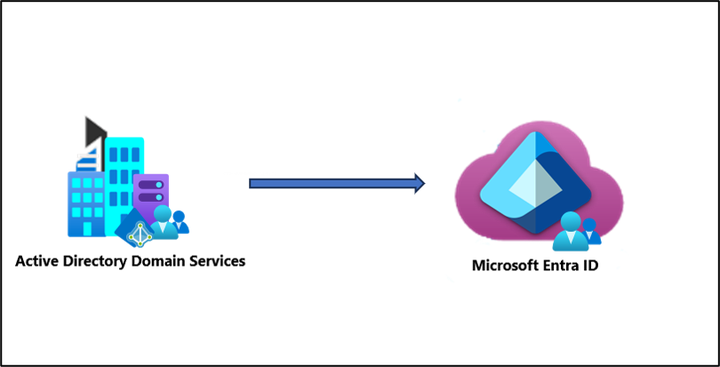
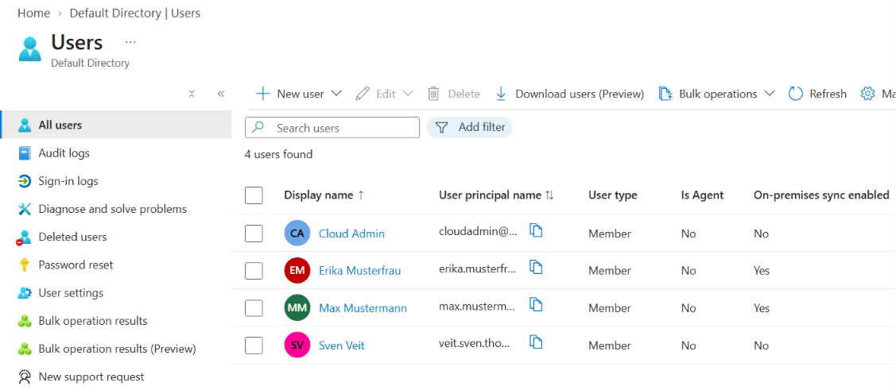
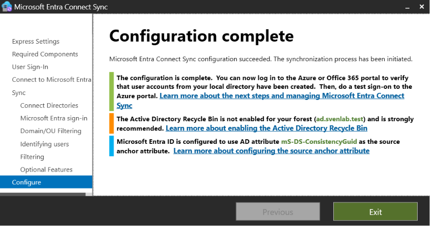
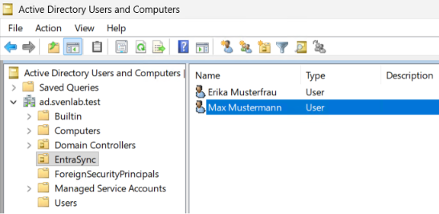
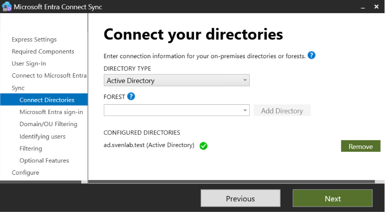
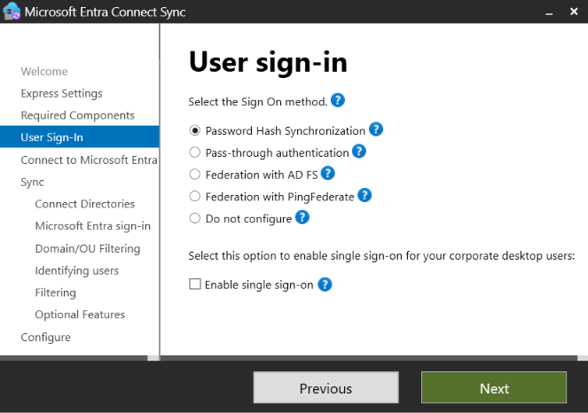
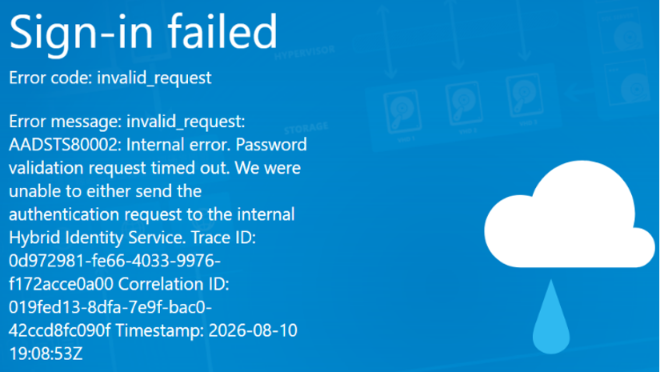

# Microsoft Entra Connect Sync

Microsoft Entra Connect Sync connects an on-premises **Active Directory Domain Services (AD DS)** environment with **Microsoft Entra ID**.

It allows identities such as users and groups to be synchronized from the local Active Directory to Microsoft Entra ID and used across both traditional on-premises services and cloud services.

This model is known as **Hybrid Identity**.



---

## 1. Basic Concept

In a traditional on-premises environment, user accounts are managed in **Active Directory Domain Services**.

Microsoft Entra ID, on the other hand, is Microsoft's cloud-based identity and access management service and is used by services such as Microsoft 365 and Azure.

In a Hybrid Identity architecture, an identity exists in both environments:

```text
On-Premises
Active Directory Domain Services
        │
        │ Microsoft Entra Connect Sync
        ▼
Microsoft Entra ID
        │
        ├── Azure
        ├── Microsoft 365
        └── Other Cloud Applications
```

Microsoft Entra Connect synchronizes the corresponding directory objects between the two systems.

It is important to understand:

> Active Directory Domain Services and Microsoft Entra ID remain two separate directory services.

The local Active Directory is therefore not simply copied completely into the cloud.

---

## 2. What Is Synchronized?

Entra Connect can synchronize objects and information such as:

- Users
- Groups
- Contacts and other supported directory objects
- User Principal Names (UPNs)
- Various user and group attributes
- Password hash data required for Password Hash Synchronization

Traditional Active Directory functionality is not simply synchronized to Entra ID, including:

- Group Policies
- Kerberos tickets
- AD-integrated DNS
- Traditional domain join functionality
- Domain Controller functionality

Entra ID therefore does **not become a Domain Controller in the cloud**.

---

## 3. Source of Authority

With a traditional Entra Connect synchronization setup, the on-premises Active Directory is generally the **Source of Authority** for synchronized identities.

For example, a user is created locally:

```text
Active Directory
      │
      │ Synchronization
      ▼
Microsoft Entra ID
```

Changes to synchronized properties are therefore typically made in the local Active Directory and then synchronized to Entra ID.

At the same time, **cloud-only users** can continue to exist directly in Entra ID.

In the lab, both synchronized users and cloud-only users were visible in Microsoft Entra ID.



Synchronized identities can be identified in Entra ID using properties such as:

```text
On-premises sync enabled
```

---

## 4. Source Anchor

Entra Connect requires a unique and persistent identifier to determine which on-premises AD object belongs to which Entra ID object.

This identifier is called the **Source Anchor**.

Modern Entra Connect configurations typically use:

```text
ms-DS-ConsistencyGuid
```

The Source Anchor provides a persistent relationship between the local object and its corresponding cloud object.

As a result, changing a username or UPN does not automatically cause Entra Connect to create an entirely new user.

In the lab, `ms-DS-ConsistencyGuid` was used as the Source Anchor during configuration.



---

## 5. UPN and Domains

The Active Directory DNS domain and the User Principal Name of a user do not have to be identical.

Example:

```text
AD Domain:
ad.contoso.com

User UPN:
max@contoso.com
```

For a clean Hybrid Identity configuration, the UPN suffix used by users should normally correspond to a domain that is verified in Microsoft Entra ID.

Lab environments often use internal domains such as:

```text
ad.example.test
```

or traditional local domains such as:

```text
contoso.local
```

These domains cannot automatically be used as public Entra ID domains.

It is therefore important to distinguish between:

- DNS domain
- NetBIOS domain
- User Principal Name (UPN)

---

## 6. Synchronization Scope

The entire Active Directory does not have to be synchronized to Entra ID.

Entra Connect supports filtering mechanisms such as **Domain and OU Filtering**.

In the lab, a dedicated Organizational Unit was created:

```text
EntraSync
```

Only the users located inside this OU were intended to be synchronized to Microsoft Entra ID.



This allows administrators to control which on-premises identities are synchronized to the cloud.

This is especially useful in larger Active Directory environments where only specific users or organizational units should participate in Hybrid Identity.

---

## 7. Connecting the On-Premises Directory

During configuration, the local Active Directory is connected to Microsoft Entra Connect.



Entra Connect requires appropriate permissions to read and synchronize the required objects and attributes from the local Active Directory.

The synchronization engine runs on a Windows Server in the on-premises environment.

In production environments, Entra Connect should preferably not be installed directly on a Domain Controller.

---

# Authentication

Identity synchronization and user authentication are two separate concepts.

Entra Connect therefore supports different **user sign-in methods**.

The three most important models are:

1. Password Hash Synchronization
2. Pass-through Authentication
3. Federation



---

## 8. Password Hash Synchronization (PHS)

**Password Hash Synchronization (PHS)** is a commonly used and comparatively simple authentication method.

With PHS, password hash data required for cloud authentication is synchronized from the local Active Directory to Microsoft Entra ID through Entra Connect.

It is important to understand:

> The plaintext password is never synchronized to Microsoft Entra ID.

The original AD password hash is also not simply copied unchanged into the cloud. Entra Connect performs additional processing and synchronizes derived hash data that Entra ID can use for authentication.

The important architectural difference is:

```text
User
   │
   ▼
Microsoft Entra ID
   │
   └── Password is validated by Entra ID
```

The local Domain Controller therefore does not need to be available during a cloud authentication.

### Advantages

- Comparatively simple architecture
- Low dependency on on-premises infrastructure
- High availability
- Cloud authentication can continue even if the local AD environment is unavailable

### Password Changes

When the password of a synchronized user is changed in the local Active Directory, the required password information is synchronized as well.

This was tested in the lab:

```text
Change password in local AD
        │
        ▼
Synchronization
        │
        ▼
Sign in to Entra ID
with the new password
```

The user was successfully able to authenticate with the new password after synchronization.

> **Remember:** PHS = Entra ID validates the password.

---

## 9. Pass-through Authentication (PTA)

**Pass-through Authentication (PTA)** uses a different authentication model.

Instead of validating the password directly in Entra ID, the authentication request is passed to the on-premises environment.

This requires a **Microsoft Entra Connect Authentication Agent**.

Simplified authentication flow:

```text
User
   │
   ▼
Microsoft Entra ID
   │
   ▼
Authentication Agent
   │
   ▼
Active Directory Domain Services
   │
   └── Password Validation
```

The local Active Directory determines whether the supplied credentials are valid.

> **Remember:** PTA = AD validates the password.

### On-Premises Dependency

Unlike PHS, the local infrastructure is part of the authentication process when using PTA.

If no Authentication Agent is available, the password validation request cannot be completed.

For production environments, multiple Authentication Agents should therefore be deployed to provide high availability.

---

## 10. PTA Failure Test in the Lab

The dependency on the Authentication Agent was deliberately tested in the lab.

Initially, authentication using PTA worked successfully.

The following service was then stopped:

```text
AzureADConnectAuthenticationAgent
```

The next authentication attempt failed.

Microsoft Entra ID returned:

```text
AADSTS80002
Password validation request timed out
```



This demonstrated that Entra ID depends on an available Authentication Agent when PTA is used.

After the Authentication Agent was started again, authentication worked successfully.

### PHS as a Fallback

Password Hash Synchronization can remain enabled while PTA is used as the primary sign-in method.

However, this does **not** mean that Entra ID automatically switches to PHS when the PTA Authentication Agents become unavailable.

```text
PTA Agent unavailable
        │
        ✕
No automatic switch
        │
        ▼
PHS
```

Having synchronized password hashes available therefore does **not provide an automatic PTA authentication fallback**.

---

## 11. Federation

The third major authentication model is **Federation**.

Federation is not a single Microsoft technology. It is an authentication and trust model.

Instead of performing the actual authentication itself, Entra ID trusts another **Identity Provider (IdP)** to authenticate the user.

A traditional Microsoft implementation is:

```text
Active Directory Federation Services (AD FS)
```

A simplified authentication flow looks like this:

```text
User
   │
   ▼
Microsoft Entra ID
   │
   │ Federated Domain
   ▼
AD FS
   │
   ▼
Active Directory Domain Services
   │
   ▼
Authentication
   │
   ▼
Token
   │
   ▼
Microsoft Entra ID
```

AD FS acts as an **Identity Provider / Security Token Service (STS)**.

AD FS typically authenticates the user against the local Active Directory and then issues a token.

Microsoft Entra ID trusts the federation partner and accepts the authentication result.

> **Remember:** Federation = Another Identity Provider authenticates the user and Entra ID trusts that provider.

---

## 12. Active Directory Federation Services (AD FS)

**Active Directory Federation Services (AD FS)** is Microsoft's traditional on-premises federation solution.

An important distinction is:

```text
AD DS
│
└── User and credential directory

AD FS
│
└── Federation Server / Identity Provider / STS
```

AD DS itself does not become a modern federation Identity Provider.

AD FS sits in front of AD DS and uses the directory to authenticate users.

Traditional Entra federation with AD FS uses protocols such as **WS-Federation**. AD FS also supports additional identity protocols for other scenarios.

AD FS can also operate independently of Microsoft Entra ID.

Applications can trust AD FS directly as their Identity Provider. AD FS authenticates the user against the local Active Directory and issues the required tokens to the application.

Compared with PHS or PTA, federation introduces additional infrastructure and operational complexity.

---

## 13. PingFederate

AD FS is not the only federation platform that can be used.

One alternative is **PingFederate**.

PingFederate is a commercial identity and federation platform that can operate as a Federation Server or Identity Provider in a similar role to AD FS.

For a fundamental understanding, it is sufficient to know:

```text
AD FS
  or
PingFederate
  or
another Federation IdP
        │
        ▼
Microsoft Entra ID trusts the IdP
```

The important concept is the federation trust relationship rather than the specific federation product.

---

## 14. PHS vs. PTA vs. Federation

| Characteristic | PHS | PTA | Federation |
|---|---|---|---|
| Password validation | Entra ID | Local AD | Federation IdP |
| On-premises environment required for cloud sign-in | No | Yes | Yes* |
| Authentication Agent required | No | Yes | No |
| Federation infrastructure required | No | No | Yes |
| Infrastructure complexity | Low | Medium | High |
| Example | Password Hash Sync | Authentication Agent | AD FS |

\* Depending on the federation architecture.

The three models can be summarized as:

```text
PHS
│
└── Entra validates

PTA
│
└── AD validates

Federation
│
└── Federation IdP authenticates
    and Entra trusts the IdP
```

---

## 15. Entra Connect Sync vs. Entra Cloud Sync

Microsoft provides another synchronization solution called **Microsoft Entra Cloud Sync**.

The basic difference is where the synchronization logic is operated and managed.

### Entra Connect Sync

- Full synchronization engine runs on-premises
- Traditional Hybrid Identity solution
- Extensive configuration capabilities
- Suitable for more complex hybrid scenarios

### Entra Cloud Sync

- Lightweight provisioning agents run on-premises
- More synchronization logic is cloud-managed
- Configuration is managed more extensively through Microsoft Entra
- Smaller on-premises infrastructure footprint

Cloud Sync represents a more cloud-managed approach to identity synchronization.

However, Entra Connect Sync and Cloud Sync do not provide complete feature parity for every possible scenario.

The appropriate synchronization technology should therefore be selected based on the requirements of the environment.

> This lab uses **Microsoft Entra Connect Sync**.

---

## 16. From Hybrid Identity to Cloud-only

Microsoft Entra Connect does not necessarily have to remain part of the architecture permanently.

Organizations can gradually move from a traditional Hybrid Identity architecture toward a **cloud-only identity architecture**.

A possible target architecture could look like this:

```text
Microsoft Entra ID
        │
        ├── Entra-joined Devices
        ├── Intune
        ├── Cloud Applications
        └── Cloud-based Identities
```

Microsoft Entra ID then becomes the primary identity platform and the dependency on the local Active Directory can gradually be reduced.

Before Domain Controllers and Entra Connect can be retired, existing dependencies on AD DS must be identified and migrated.

Typical dependencies include:

- LDAP applications
- Kerberos
- NTLM
- Traditional domain joins
- Group Policies
- File servers
- NTFS permission models
- Service accounts
- AD-integrated DNS
- Active Directory Certificate Services
- Legacy applications

Only after these dependencies have been removed or migrated can a complete cloud-only architecture be considered.

---

## 17. Practical Lab

The lab used a Windows Server environment to simulate a traditional on-premises Active Directory environment.

### Environment

```text
Windows Server
│
├── Active Directory Domain Services
├── DNS
│
└── Microsoft Entra Connect Sync
        │
        ▼
Microsoft Entra ID
```

The lab included the following steps:

1. Installed Active Directory Domain Services
2. Configured DNS
3. Created an Active Directory forest
4. Created the `EntraSync` OU
5. Created test users
6. Configured an additional UPN suffix
7. Installed Microsoft Entra Connect Sync
8. Connected the local Active Directory
9. Configured OU Filtering
10. Synchronized users to Microsoft Entra ID
11. Verified synchronized users in Entra ID
12. Tested Password Hash Synchronization
13. Changed an AD password and tested synchronization
14. Enabled Pass-through Authentication
15. Tested authentication through PTA
16. Stopped the Authentication Agent
17. Observed the resulting authentication failure
18. Restarted the Authentication Agent and verified successful authentication again

The lab therefore covered both the **identity synchronization process** and the behavior of different authentication methods.

---

## 18. Key Takeaways

Microsoft Entra Connect provides a bridge between traditional **Active Directory Domain Services** and **Microsoft Entra ID**.

Two concepts should always be clearly separated:

```text
Identity Synchronization
        │
        └── Which users and attributes
            are synchronized to Entra ID?

Authentication
        │
        └── Who validates the
            user's credentials?
```

The three central authentication models can be summarized as:

- **PHS:** Microsoft Entra ID validates the cloud authentication.
- **PTA:** The local Active Directory validates the password through an Authentication Agent.
- **Federation:** A separate Identity Provider such as AD FS performs the authentication and Entra ID trusts the result.

For many modern Hybrid Identity environments, PHS provides a comparatively simple architecture with less dependency on the availability of the on-premises infrastructure.

The practical lab demonstrated the difference between **synchronization and authentication**, as well as the different dependencies on local infrastructure when using PHS and PTA.
