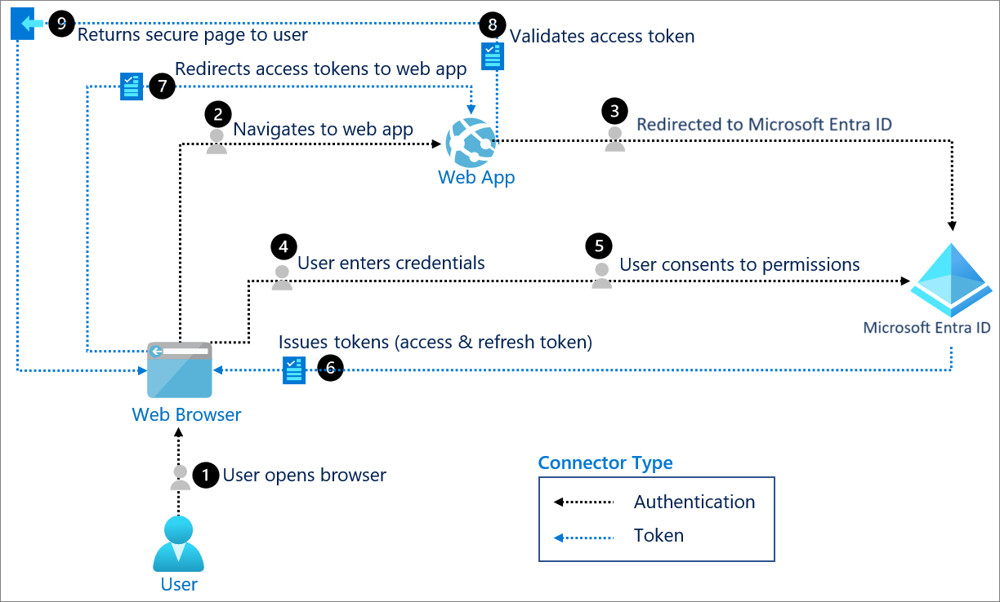

# OpenID Connect (OIDC) Fundamentals

OpenID Connect is an **authentication layer built on top of OAuth 2.0**. Where OAuth2 answers "what is this application allowed to access?", OIDC answers "who is the user?". It reuses the OAuth2 Authorization Code flow but adds a new token type and a standardized way to retrieve user identity information.

## What OIDC Adds to OAuth2

| Addition | Purpose |
|---|---|
| ID Token | A JWT containing claims about the authenticated user |
| `openid` scope | Signals to the authorization server that this is an OIDC request, not plain OAuth2 |
| UserInfo Endpoint | Optional endpoint to fetch additional user profile claims using the access token |
| Discovery Endpoint | `/.well-known/openid-configuration` — publishes the provider's endpoints, supported scopes, and signing keys |

## ID Token Claims

The ID Token is a JWT, structurally similar to an access token, but its purpose is strictly to convey identity to the client — it should not be sent to a resource server as an authorization credential.

Common claims:

- `iss` – issuer (e.g. `https://login.microsoftonline.com/{tenant-id}/v2.0`)
- `sub` – subject, a stable identifier for the user within this issuer
- `aud` – audience, the client ID the token was issued for
- `exp` / `iat` – expiry and issued-at timestamps
- `nonce` – value the client generates and validates to prevent replay attacks
- `name`, `preferred_username`, `email` – returned depending on requested scopes (`profile`, `email`)

## Authentication vs. Authorization

| | OAuth 2.0 | OpenID Connect |
|---|---|---|
| Question answered | What can the app do? | Who is the user? |
| Token issued | Access Token (+ Refresh Token) | ID Token (in addition to Access Token) |
| Consumed by | Resource Server / API | Client application itself |
| Token format | Often opaque or JWT | Always JWT |

## Example: OIDC Flow with Microsoft Entra ID

The same flow used for the OAuth2 Authorization Code example also demonstrates OIDC, since Entra ID returns an ID token together with the access token in step 6:

The key difference at the protocol level: the initial authorization request (step 2) includes `openid` in the `scope` parameter, and the token response (step 6) contains an `id_token` in addition to the `access_token`. The web app validates the ID token's signature and claims locally (step 8) to establish the user's identity — it does not need to call an API to know who signed in.

## Practical Notes

- Never use the ID Token as a bearer token against an API. It is meant for the client only; APIs should validate access tokens.
- Always validate the `nonce` claim if one was sent in the request — this is what prevents token replay/injection attacks.
- `jwt.ms` decodes Entra ID ID tokens and access tokens for troubleshooting claims issues (e.g. missing `email` claim when the `email` scope wasn't requested).
- A frequent gap: requesting only `openid profile` and then being surprised the `email` claim is missing — it requires the explicit `email` scope.

## Protocol Comparison: OAuth2 vs. OIDC vs. SAML

| | OAuth 2.0 | OpenID Connect | SAML 2.0 |
|---|---|---|---|
| Purpose | Authorization | Authentication + Authorization | Authentication |
| Token format | JWT or opaque | JWT | XML |
| Typical era | Modern APIs, mobile/SPA | Modern web/SSO | Legacy enterprise SSO |
| Transport | HTTP redirects + JSON | HTTP redirects + JSON | HTTP redirects/POST + XML |
| Common use today | API authorization | Consumer & enterprise SSO | Enterprise SaaS SSO (still widely required by vendors) |

SAML remains relevant primarily because many established enterprise SaaS products still require it for SSO integration, even though OIDC has become the default choice for new implementations.

## Key Takeaways

- OIDC = OAuth2 + a standardized identity layer (ID Token, UserInfo, Discovery).
- The ID Token is for the client to establish identity; the Access Token is for calling APIs — don't mix them up.
- SAML still shows up in enterprise environments; OIDC is the modern default for new SSO integrations.
