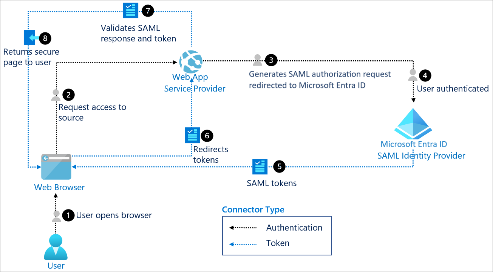

# SAML 2.0 Fundamentals

SAML (Security Assertion Markup Language) 2.0 is an XML-based standard for exchanging authentication and authorization data between an Identity Provider (IdP) and a Service Provider (SP). It predates OAuth2/OIDC and is still widely required for SSO integration with established enterprise SaaS platforms.

## Core Roles

| Role | Description |
|---|---|
| Identity Provider (IdP) | Authenticates the user and issues SAML assertions (e.g. Microsoft Entra ID) |
| Service Provider (SP) | The application relying on the IdP to authenticate users (e.g. a SaaS web app) |

## Core Concepts

- **Assertion** – an XML document issued by the IdP stating that a user was authenticated, including attributes about that user (name, email, group membership, etc.).
- **Bindings** – how SAML messages are transported between parties. The two most common:
  - **HTTP Redirect Binding** – used for the initial authentication request (fits in a URL, so it's size-limited)
  - **HTTP POST Binding** – used for the SAML response/assertion (form-based POST, no size limit)
- **Metadata** – XML documents describing each party's endpoints and public signing certificates. SP metadata and IdP metadata are exchanged once during setup to establish trust.
- **SSO Flow direction**:
  - **SP-initiated** – user starts at the application, which redirects to the IdP for authentication.
  - **IdP-initiated** – user starts at the IdP (e.g. an app launcher/portal) and is pushed to the application with an assertion already in hand.

## Example: SP-Initiated Flow with Microsoft Entra ID

Flow walkthrough:

1. User opens the browser.
2. User requests access to the application (Service Provider).
3. The Service Provider generates a SAML authorization request and redirects the browser to Microsoft Entra ID (the SAML Identity Provider).
4. The user authenticates against Entra ID.
5. Entra ID issues a SAML token (assertion) back to the browser.
6. The browser is redirected back to the Service Provider, carrying the SAML response (typically via HTTP POST binding).
7. The Service Provider validates the SAML response — signature, issuer, audience restriction, and assertion expiry.
8. The secure page is returned to the user.

## Practical Notes

- Clock skew between IdP and SP is a common source of "assertion expired" errors even when the assertion was just issued — SAML assertions have tight `NotBefore`/`NotOnOrAfter` validity windows.
- Certificate rotation on the IdP side is a frequent operational gotcha: if the SP still has the old signing certificate cached in its metadata, valid assertions get rejected as invalid signatures.
- Attribute mapping (which SAML attribute maps to which SP-side user field, e.g. `NameID` vs. a custom email attribute) is a common source of "user not found" errors on first login — worth checking the SP's expected attribute names against what the IdP actually sends.
- Unlike OIDC's JSON-based tokens, SAML assertions are XML and signed as a whole document (or with signed elements within it) — troubleshooting typically means inspecting the raw SAML response (browser dev tools or a SAML tracer extension) rather than a JWT decoder.

## Key Takeaways

- SAML separates cleanly into IdP (authenticates) and SP (relies on that authentication) roles.
- SP-initiated flow is the most common pattern for user-facing SSO into SaaS applications.
- Assertion validity windows and certificate rotation are the two most frequent real-world failure points.
