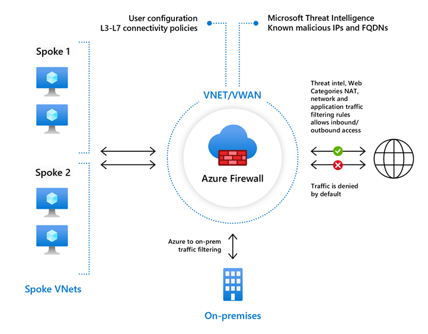
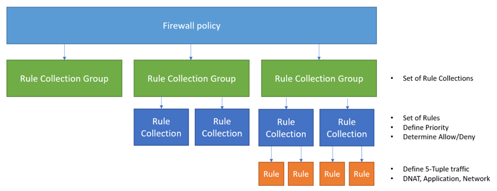
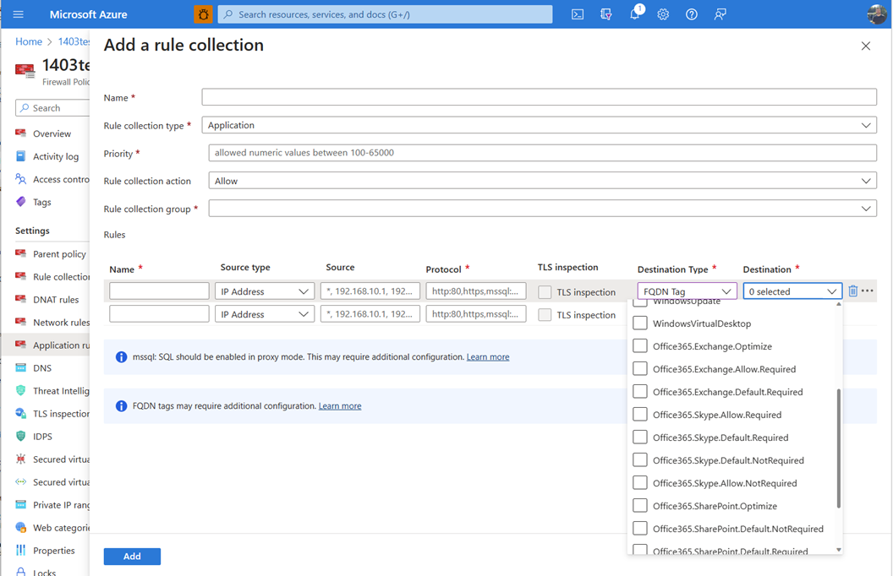
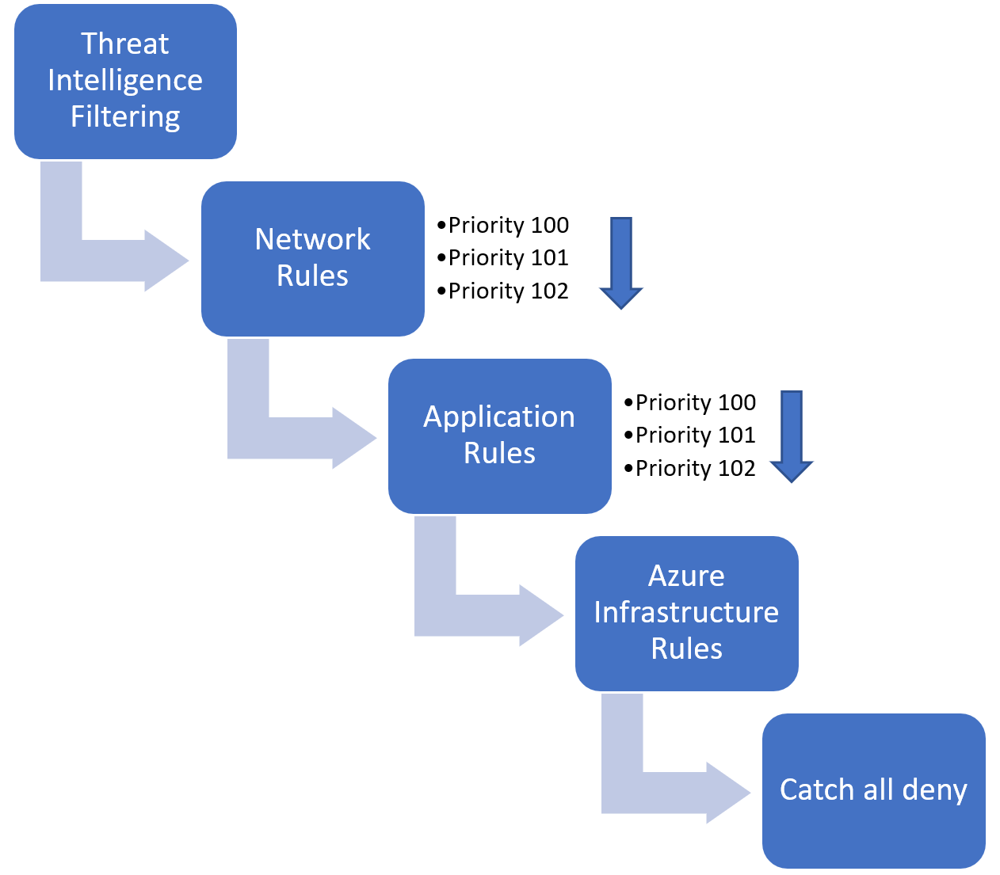
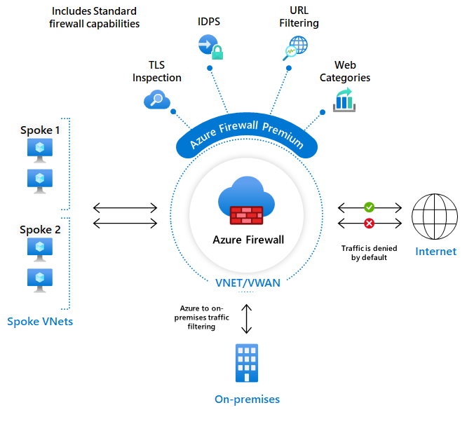

# Azure Firewall

Azure Firewall is a managed, stateful network security service for controlling traffic between Azure networks, on-premises environments, and the Internet.

It is commonly deployed as a central security component in hub-and-spoke architectures. Workload traffic from spoke VNets can be routed through the firewall, allowing network and application access policies to be managed centrally instead of individually for every workload.

This page summarizes the main Azure Firewall concepts and documents a practical hub-and-spoke lab, including routing, firewall policies, rule processing, SNAT/DNAT, forced tunneling, and selected Premium features.

---

## 1. Azure Firewall Overview

Azure Firewall operates as a centralized traffic filtering service.

Typical traffic flows include:

- Spoke VNet → Internet
- Spoke VNet → another spoke
- Azure → on-premises
- On-premises → Azure
- Internet → Azure workloads through DNAT

Azure Firewall is **stateful**. When a connection is allowed, the firewall tracks the connection state and automatically recognizes the corresponding return traffic.

A common architecture places the firewall in a central hub VNet while application workloads remain in separate spoke VNets.



The important architectural principle is that deploying a firewall alone does not automatically send traffic through it. Azure routing must direct the required traffic to the firewall.

---

## 2. Hub-and-Spoke Architecture

A typical centralized architecture looks like this:

```text
                    Internet
                       |
                       |
                Azure Firewall
                       |
                 +-----+-----+
                 |    Hub    |
                 +-----+-----+
                       |
          +------------+------------+
          |            |            |
       Spoke 1       Spoke 2      Spoke 3
```

The hub contains shared networking components such as Azure Firewall, while workloads are placed in spoke VNets.

The spokes are connected to the hub using VNet peering.

However, **VNet peering alone does not force traffic through Azure Firewall**.

User-defined routes are required when the firewall should become the next hop for specific traffic.

---

## 3. AzureFirewallSubnet

Azure Firewall requires a dedicated subnet named:

`AzureFirewallSubnet`

This subnet is reserved for the firewall infrastructure.

A typical structure could therefore look like:

```text
Hub VNet
│
├── AzureFirewallSubnet
│   └── Azure Firewall
│
├── AzureBastionSubnet
│   └── Azure Bastion
│
└── GatewaySubnet
    └── VPN / ExpressRoute Gateway
```

The exact components depend on the architecture.

---

## 4. Public IP Addresses

Azure Firewall can use public IP addresses for Internet-facing communication.

They are relevant for two major scenarios.

### Outbound Traffic

When workloads access the Internet through Azure Firewall, the firewall can perform **Source Network Address Translation (SNAT)**.

Conceptually:

```text
VM private IP
     |
     v
Azure Firewall
     |
     | SNAT
     v
Firewall public IP
     |
     v
Internet
```

The external destination therefore sees the firewall's public IP rather than the private address of the workload.

### Inbound Traffic

Azure Firewall can also expose internal workloads using **Destination Network Address Translation (DNAT)**.

Conceptually:

```text
Internet Client
      |
      v
Firewall Public IP
      |
      | DNAT
      v
Internal Workload
```

The firewall translates the destination from its public IP and port to the private destination configured in the DNAT rule.

---

## 5. Routing Traffic Through Azure Firewall

One of the most important concepts from the lab was the relationship between **routing and firewalling**.

Azure Firewall only processes traffic that actually reaches it.

For example, a route table associated with a spoke subnet can contain:

```text
Destination:   0.0.0.0/0
Next hop type: Virtual appliance
Next hop:      <Azure Firewall private IP>
```

The resulting path becomes:

```text
Spoke VM
   |
   v
Route Table
   |
   v
Azure Firewall
   |
   v
Internet
```

Without the corresponding route, Azure may use another available route and the firewall would never see the connection.

---

## 6. Azure Firewall Policy

Azure Firewall Policy provides the central configuration for firewall rules and related security settings.

Its rule hierarchy is important to understand.



Conceptually:

```text
Firewall Policy
      |
      +-- Rule Collection Group
              |
              +-- Rule Collection
                      |
                      +-- Rule
                      +-- Rule
```

### Rule Collection Group

A Rule Collection Group is the highest organizational layer for firewall rules.

It can contain multiple rule collections and has its own priority.

### Rule Collection

A Rule Collection groups rules of a particular type and defines properties such as:

- priority
- action
- rule type

### Rule

The individual rule defines the actual traffic criteria, such as:

- source
- destination
- protocol
- source/destination ports
- FQDNs

This hierarchy becomes especially useful when firewall policies contain many rules.

---

## 7. Firewall Rule Types

Azure Firewall mainly uses three rule categories:

- Network Rules
- Application Rules
- DNAT Rules

Each addresses a different use case.

### Network Rules

Network rules operate primarily at Layer 3 and Layer 4.

They are suitable when access should be controlled using:

- source IP
- destination IP
- protocol
- destination port

Example:

```text
Source:      10.20.1.0/24
Destination: 10.30.1.10
Protocol:    TCP
Port:        443
Action:      Allow
```

Typical use cases include controlling access between internal networks or allowing specific TCP/UDP connections.

### Application Rules

Application rules provide application-aware filtering, particularly for HTTP and HTTPS traffic.

Instead of maintaining destination IP addresses, access can be controlled using domain names.

For example:

```text
Source:      10.20.1.0/24
Protocol:    HTTPS
Destination: example.com
Action:      Allow
```

This is particularly useful for workloads that need controlled outbound Internet access.

Azure also provides **FQDN Tags** for certain Microsoft services.



Instead of manually maintaining all required domains for supported services, predefined FQDN tags can simplify the configuration.

### DNAT Rules

DNAT rules are used for inbound connections.

Example:

```text
Internet
   |
   | TCP/443
   v
Azure Firewall Public IP
   |
   | DNAT
   v
10.20.1.10:443
```

This allows an internal service to be reached through the public IP address of Azure Firewall without assigning a public IP directly to the workload.

---

## 8. Rule Processing

Understanding the rule processing order is important when troubleshooting unexpected firewall behavior.



At a high level, Azure Firewall evaluates rule categories in a defined order rather than simply processing every rule as one flat list.

The diagram illustrates the general sequence:

```text
Threat Intelligence
        ↓
Network Rules
        ↓
Application Rules
        ↓
Azure Infrastructure Rules
        ↓
Implicit Deny
```

Priorities inside the relevant rule structures determine which rules are evaluated first.

A useful operational principle is:

> If traffic is unexpectedly allowed or denied, check both the rule priority and the rule category.

Traffic that does not match an applicable allow rule is ultimately denied.

---

## 9. Default Deny

Azure Firewall follows a **default-deny** security model.

This means traffic is not automatically allowed simply because it can be routed to the firewall.

The firewall needs an appropriate rule that permits the connection.

Conceptually:

```text
Traffic reaches firewall
          |
          v
Matching allow rule?
       /      \
     Yes       No
      |         |
    Allow      Deny
```

Routing and firewall rules therefore solve two separate problems:

- **Routing:** Where should the packet go?
- **Firewall policy:** Is the packet allowed to go there?

This distinction was one of the key concepts in the lab.

---

## 10. Stateful Firewall Behavior

Azure Firewall is stateful.

Suppose a VM initiates an allowed HTTPS connection:

```text
VM
 |
 | TCP connection
 v
Azure Firewall
 |
 v
Internet
```

The firewall tracks the connection state.

Return packets belonging to the established connection are recognized automatically.

This is different from treating every packet independently and is an important reason why symmetric traffic paths matter in firewall architectures.

---

## 11. Asymmetric Routing

Stateful firewalls expect the relevant connection traffic to traverse the firewall consistently.

Problems can occur when the outbound path and return path differ.

For example:

```text
Outbound:

VM → Azure Firewall → Destination

Return:

Destination → Different Network Path → VM
```

The firewall may see only one side of the connection.

This is called **asymmetric routing** and can cause connections to fail.

When designing centralized firewall architectures, both routing directions therefore need to be considered.

---

## 12. SNAT

Source Network Address Translation changes the source address of a connection.

A typical outbound flow is:

```text
10.20.1.4
   |
   v
Azure Firewall
   |
   | SNAT
   v
Firewall Public IP
   |
   v
Internet
```

During the lab, outbound connectivity was useful for verifying that traffic was actually traversing the intended egress path.

Checking the externally visible source IP can help validate the design.

---

## 13. DNAT

Destination Network Address Translation changes the destination of incoming traffic.

Example:

```text
Client
  |
  | FirewallPublicIP:443
  v
Azure Firewall
  |
  | DNAT
  v
10.20.1.4:443
```

This provides centralized inbound publishing through the firewall.

The workload itself does not require its own public IP address.

DNAT is therefore conceptually different from normal network and application rules:

- Network/Application Rules primarily control permitted traffic.
- DNAT additionally translates the destination.

---

## 14. Azure Firewall and NAT Gateway

Azure NAT Gateway and Azure Firewall can both be involved in outbound connectivity, but they solve different problems.

### Azure Firewall

Provides security capabilities such as:

- stateful filtering
- network rules
- application rules
- threat intelligence
- centralized security policies
- DNAT

### NAT Gateway

Primarily provides scalable outbound NAT and predictable public source IP addresses.

It is not a replacement for a firewall policy.

A design can therefore use both services depending on the required architecture.

The key question is always:

> Which component should be responsible for the workload's outbound path?

Routing and subnet associations must match that design.

---

## 15. Forced Tunneling

Forced tunneling describes architectures where Internet-bound traffic is intentionally redirected toward another network path instead of leaving directly through Azure.

A common example is:

```text
Azure Workload
      |
      v
Azure Firewall
      |
      v
VPN / ExpressRoute
      |
      v
On-Premises
      |
      v
Internet
```

Organizations may use this when Internet egress must pass through centralized on-premises security infrastructure.

This is mainly relevant in hybrid enterprise environments.

The concept should not be confused with simply routing spoke Internet traffic through Azure Firewall. Forced tunneling specifically changes the firewall's own Internet-bound routing toward another network path.

---

## 16. Azure Firewall Tiers

Azure Firewall is available with different feature sets.

The main practical distinction is between the core firewall capabilities and the additional advanced security functionality available with Premium.

### Standard

Azure Firewall Standard provides the main centralized firewall functionality required for many Azure environments.

This includes capabilities such as:

- network filtering
- application filtering
- NAT
- threat intelligence
- centralized firewall policies

### Premium

Premium builds on the standard capabilities and adds advanced inspection features.



Important Premium capabilities include:

- TLS Inspection
- IDPS
- URL Filtering
- Web Categories

These features become particularly relevant when Azure Firewall is expected to perform deeper security inspection rather than primarily network and application access control.

---

## 17. TLS Inspection

HTTPS normally encrypts communication between the client and destination.

Without decrypting the connection, a firewall has limited visibility into the actual encrypted payload.

TLS Inspection allows Azure Firewall Premium to inspect supported encrypted traffic.

Conceptually:

```text
Client
   |
   | Encrypted TLS
   v
Azure Firewall Premium
   |
   | TLS inspection
   v
Destination
```

This enables deeper inspection but also introduces additional certificate and operational requirements.

For this reason, TLS Inspection should be deliberately designed rather than simply enabled globally without considering its impact.

---

## 18. IDPS

**Intrusion Detection and Prevention System (IDPS)** provides additional inspection for potentially malicious network activity.

It uses signatures to identify suspicious traffic patterns and known attack techniques.

Depending on configuration, suspicious traffic can be detected or blocked.

This moves Azure Firewall Premium beyond basic source/destination/port filtering toward deeper network security inspection.

---

## 19. URL Filtering

URL Filtering provides more granular web filtering than basic destination-based rules.

Instead of only considering the domain, policies can make decisions based on more specific URL information where supported.

This can be useful when access to parts of a website should be controlled more precisely.

---

## 20. Web Categories

Web Categories allow Internet destinations to be controlled based on categories rather than maintaining individual websites manually.

Conceptually:

```text
Allow:
- Business
- Technology

Block:
- Gambling
- Malware
```

This is useful for centrally enforcing organizational Internet access policies.

---

## 21. Threat Intelligence

Azure Firewall integrates Microsoft threat intelligence information about known malicious IP addresses and domains.

This provides an additional security layer beyond manually configured firewall rules.

Conceptually:

```text
Normal Firewall Rules
        +
Microsoft Threat Intelligence
        =
Additional protection against known malicious destinations
```

Threat Intelligence does not replace a properly designed firewall policy. It complements it.

---

## 22. Practical Lab

The lab focused on understanding the basic traffic path through a centrally deployed Azure Firewall.

The environment followed a hub-and-spoke approach.

Conceptually:

```text
                    Internet
                       |
                       |
                Azure Firewall
                       |
                   Hub VNet
                       |
              VNet Peering
                       |
                  Spoke VNet
                       |
                      VM
```

The spoke VM did not require its own public IP address.

Azure Bastion could be used for administrative access while workload traffic followed the intended routing path.

---

## 23. Lab Workflow

The practical workflow was approximately:

```text
Create Hub VNet
      ↓
Create Spoke VNet
      ↓
Peer Hub and Spoke
      ↓
Deploy Azure Firewall in Hub
      ↓
Create Firewall Policy
      ↓
Create Firewall Rules
      ↓
Create Route Table
      ↓
Associate Route Table with Spoke
      ↓
Route traffic to Azure Firewall
      ↓
Test connectivity
```

This demonstrates an important Azure networking principle:

> **Firewall deployment, routing, and firewall policy are separate configuration layers that must work together.**

---

## 24. Testing the Traffic Path

Several simple tools can be useful when validating the environment.

For example:

```bash
ip addr
```

can be used to inspect the VM's network configuration.

DNS resolution can be tested with:

```bash
nslookup example.com
```

Connectivity tests should answer separate questions:

1. Can DNS resolve the destination?
2. Is there a valid route?
3. Does the traffic reach Azure Firewall?
4. Does a firewall rule allow it?
5. Is the return path valid?

Separating these layers makes troubleshooting significantly easier.

---

## 25. Troubleshooting Approach

When traffic through Azure Firewall does not work, checking the environment layer by layer is more effective than immediately changing firewall rules.

A useful sequence is:

```text
DNS
 ↓
Routing
 ↓
Firewall Policy
 ↓
NAT
 ↓
Return Path
```

### Check Routing

Verify:

- Route Table association
- configured UDRs
- next-hop type
- Azure Firewall private IP
- effective routes

### Check Firewall Rules

Verify:

- correct rule type
- source
- destination
- protocol
- destination port
- action
- priority

### Check DNS

Application rules based on FQDNs depend on successful name resolution.

### Check NAT

For outbound Internet traffic, verify which public source IP is visible externally.

For inbound traffic, verify the DNAT configuration and destination.

### Check the Return Path

If routing appears correct but connections still fail, asymmetric routing should be considered.

---

## 26. Firewall Logging

In production environments, firewall logs are important for both troubleshooting and security monitoring.

They can provide visibility into areas such as:

- allowed connections
- denied connections
- network rule matches
- application rule matches
- DNS behavior
- threat intelligence events

Logs can be integrated into a broader monitoring or SIEM architecture.

Depending on the environment, this could involve Azure-native monitoring components or external security platforms.

The exact logging architecture should be designed separately from the firewall's traffic-routing architecture.

---

Azure Firewall becomes particularly useful when multiple networks and workloads require centralized and consistent traffic filtering. The core architectural concept is the separation between **routing** and **security policy**:

> **Routing determines which traffic reaches Azure Firewall. Firewall Policy determines what Azure Firewall does with that traffic.**
