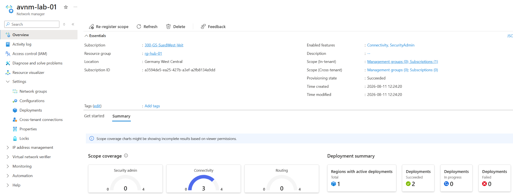
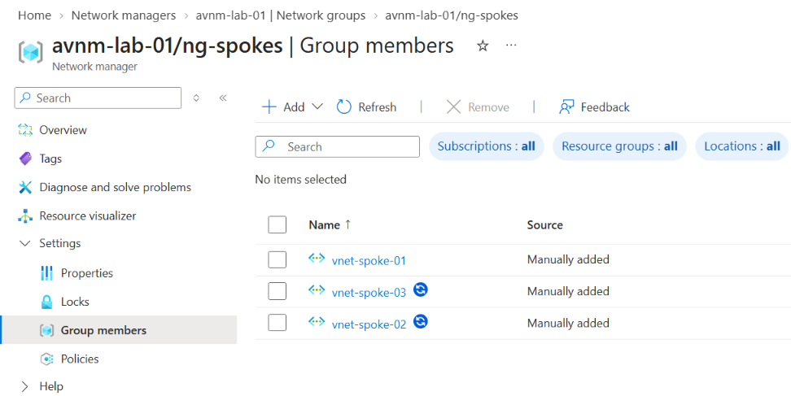
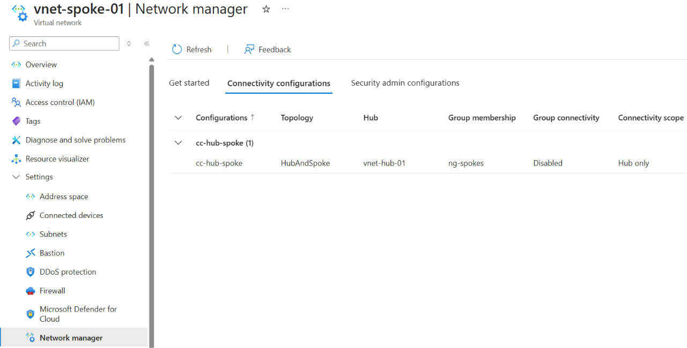
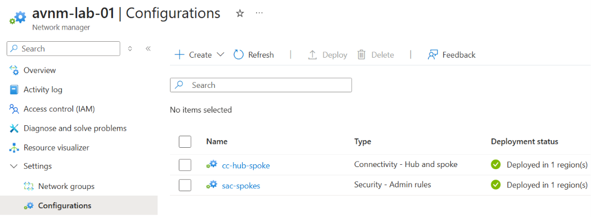
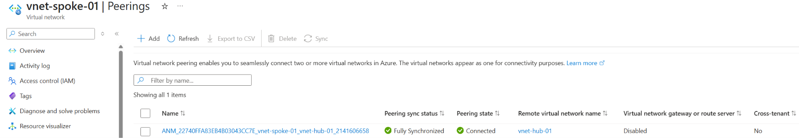
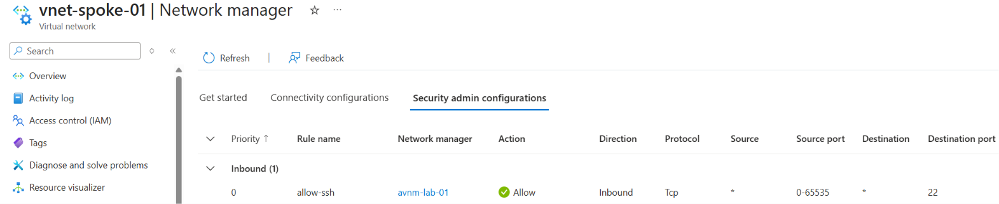

# Azure Virtual Network Manager

## Overview

**Azure Virtual Network Manager (AVNM)** is a centralized management service for managing network connectivity, security policies, and routing across multiple Azure Virtual Networks.

Instead of configuring connectivity and security individually on every VNet, Azure Virtual Network Manager provides a central management and orchestration layer.

This becomes particularly useful in larger Azure environments containing many:

- Virtual Networks
- Subscriptions
- Management Groups
- Hub-and-Spoke architectures
- Application or workload networks

A simplified model looks like this:

```text
Azure Virtual Network Manager
        │
        ▼
Management Scope
        │
        ▼
Network Groups
        │
        ▼
Virtual Networks
        │
        ▼
Connectivity / Security Configurations
        │
        ▼
Deployment
        │
        ▼
Configuration applied to VNets
```

In small environments, manually managing VNet peerings and NSGs may be sufficient. In larger environments or enterprise landing zones, AVNM can significantly reduce operational overhead and help maintain consistent network configurations.

---

## Core Architecture

Azure Virtual Network Manager consists of several important components:

| Component | Purpose |
|---|---|
| Network Manager | Central management resource |
| Management Scope | Defines which subscriptions or management groups can be managed |
| Network Groups | Logical groups of VNets |
| Connectivity Configuration | Defines connectivity between VNets |
| Security Admin Configuration | Defines centrally managed security rules |
| Routing Configuration | Centrally manages routing behavior |
| Deployment | Applies configurations to selected Azure regions |

The important distinction is that AVNM does not simply represent another network device.

It acts primarily as a **management and orchestration layer** for Azure networking.

---

# Lab Environment

For this lab, I created an Azure Virtual Network Manager named:

```text
avnm-lab-01
```

The environment consisted of one hub VNet and three spoke VNets.

```text
avnm-lab-01
│
├── ng-spokes
│   ├── vnet-spoke-01
│   ├── vnet-spoke-02
│   └── vnet-spoke-03
│
├── cc-hub-spoke
│   └── ng-spokes ↔ vnet-hub-01
│
└── sac-spokes
    └── rc-spokes
        └── allow-ssh (TCP/22)
```

The lab focused on two AVNM capabilities:

1. **Connectivity**
2. **Security Admin**

User-defined routing was not implemented in this lab.

---

# Network Manager and Management Scope

When creating an Azure Virtual Network Manager, a **management scope** must be defined.

The management scope determines which Azure resources the Network Manager is allowed to manage.

The scope can include:

- Management Groups
- Subscriptions

For this lab, a single Azure subscription was registered as the management scope.

The following features were enabled:

- **Connectivity**
- **Security Admin**



The overview page provides information about the registered scope, enabled features, deployment status, and configuration coverage.

Using Management Groups as the scope can become especially useful in larger enterprise environments because a Network Manager can then centrally manage networking across multiple subscriptions.

---

# Network Groups

A **Network Group** is a logical collection of Virtual Networks.

Instead of applying configurations to every VNet individually, VNets can be grouped and configurations can then target the entire group.

For this lab, I created:

```text
ng-spokes
```

The following VNets were added:

```text
vnet-spoke-01
vnet-spoke-02
vnet-spoke-03
```



An important detail is that the **Virtual Network itself** becomes a member of the Network Group, not an individual subnet.

Network Group membership can be maintained manually or automated through dynamic membership rules.

Dynamic membership becomes particularly useful in environments where VNets are frequently created or removed.

---

# Connectivity Configurations

A **Connectivity Configuration** defines how VNets managed by AVNM should be connected.

Azure Virtual Network Manager supports connectivity models such as:

- Hub-and-Spoke
- Direct connectivity between Network Group members

For this lab, I implemented a Hub-and-Spoke configuration.

The configuration was named:

```text
cc-hub-spoke
```

The topology consisted of:

```text
                  vnet-hub-01
                  /    |    \
                 /     |     \
                /      |      \
               ▼       ▼       ▼
       vnet-spoke-01  vnet-spoke-02  vnet-spoke-03
```

The Network Group was:

```text
ng-spokes
```

and the hub was:

```text
vnet-hub-01
```

The option to connect the Network Group to the hub was enabled.

Direct connectivity within the Network Group was **not enabled**.



This resulted in a traditional Hub-and-Spoke topology where each spoke is connected to the hub without creating additional direct connectivity between all spoke VNets.

---

# Direct Connectivity Between Network Groups

Azure Virtual Network Manager can also provide direct connectivity between VNets within a Network Group.

When **Direct connectivity within network group** is enabled, the VNets in the group can communicate directly according to the deployed connectivity configuration.

This can simplify environments that require connectivity between many VNets because individual connectivity relationships do not have to be maintained manually.

For the architecture used in this lab, this feature was intentionally not enabled because the goal was a classic Hub-and-Spoke design.

---

# Deploying the Connectivity Configuration

Creating a Connectivity Configuration alone does **not** immediately modify the VNets.

The configuration must first be deployed.

AVNM deployments target selected Azure regions.

For this lab, the configuration was deployed to:

```text
Germany West Central
```

After deployment, AVNM applied the Hub-and-Spoke connectivity configuration to the corresponding VNets.

The configuration overview showed the successful deployment.



This separation between **configuration** and **deployment** is an important AVNM concept:

```text
Create configuration
        │
        ▼
Configuration exists in AVNM
        │
        ▼
Deploy configuration
        │
        ▼
Select target region
        │
        ▼
Configuration applied to VNets
```

---

# Result: AVNM-Managed VNet Peering

After deploying the Connectivity Configuration, the resulting connectivity became visible directly on the Virtual Networks.

For example, `vnet-spoke-01` showed a connection to:

```text
vnet-hub-01
```



This demonstrates one of the main benefits of AVNM.

Instead of manually creating and maintaining the connectivity for every individual spoke, the desired topology is centrally defined through Azure Virtual Network Manager.

The applied configuration can also be inspected directly from the VNet under:

```text
Virtual Network
└── Network manager
    └── Connectivity configurations
```

This provides visibility into which centrally managed connectivity configuration applies to a particular VNet.

---

# Security Admin Configurations

Azure Virtual Network Manager also provides **Security Admin Configurations**.

Security Admin Rules provide centrally managed security policies across multiple VNets.

They are particularly useful when an organization wants to separate responsibilities between:

```text
Central Network / Security Team
            │
            ├── Security Admin Rules
            │
            ▼
     Organization-wide policy
            │
            ▼
        Virtual Network
            │
            ▼
            NSG
            │
            ▼
   Workload-specific rules
```

Security Admin Rules do **not simply replace Network Security Groups**.

NSGs remain important for workload-specific security controls at the subnet and network interface level.

Security Admin Rules instead provide an additional centralized policy layer.

---

# Security Admin Configuration Lab

For the lab, I created the following Security Admin Configuration:

```text
sac-spokes
```

Inside the configuration, I created the Rule Collection:

```text
rc-spokes
```

The target was:

```text
ng-spokes
```

I then created the following test rule:

| Setting | Value |
|---|---|
| Name | `allow-ssh` |
| Direction | Inbound |
| Protocol | TCP |
| Source | Any |
| Destination | Any |
| Destination Port | 22 |
| Action | Allow |

The configuration was then deployed to:

```text
Germany West Central
```

After deployment, the rule became visible on the affected spoke VNets under:

```text
Virtual Network
└── Network manager
    └── Security admin configurations
```



An important observation from the lab was that the rule does **not appear as a normal NSG rule**.

It remains centrally managed through Azure Virtual Network Manager.

---

# Security Admin Rules vs. NSGs

Security Admin Rules and Network Security Groups serve different purposes.

| Security Admin Rules | Network Security Groups |
|---|---|
| Centrally managed | Usually workload-specific |
| Applied through AVNM | Applied to subnets or NICs |
| Designed for organization-wide policies | Designed for local network filtering |
| Managed by central networking/security teams | Often managed by workload teams |
| Can enforce higher-level security decisions | Controls workload-level traffic |

This enables a useful responsibility model.

For example:

```text
Central Security Team
        │
        └── Corporate network policies
                 │
                 ▼
        Security Admin Rules
                 │
                 ▼
              VNet
                 │
                 ▼
                NSG
                 │
                 ▼
        Application workload
```

The application team can continue managing workload-specific NSG rules while the central security team maintains organization-wide network policies.

---

# Security Admin Rule Actions

Security Admin Rules support several actions, including:

- `Allow`
- `Deny`
- `Always Allow`

The distinction between **Allow** and **Always Allow** is particularly important.

### Allow

With a normal `Allow` rule, the Security Admin Rule allows the traffic at the AVNM security layer, but the traffic is still evaluated by downstream NSG rules.

Conceptually:

```text
Security Admin Rule
        │
      Allow
        │
        ▼
       NSG
        │
        ▼
Further evaluation
```

### Always Allow

`Always Allow` provides stronger central enforcement.

Traffic matching the rule is allowed without being blocked again by downstream NSG rules.

Conceptually:

```text
Security Admin Rule
        │
  Always Allow
        │
        ▼
Traffic allowed
```

This capability allows a central networking or security team to enforce connectivity requirements that local workload teams cannot override through their NSGs.

---

# User-Defined Routing

Azure Virtual Network Manager also provides centralized **User-Defined Routing** capabilities.

The concept should not simply be understood as copying the same traditional Route Table to multiple VNets.

Instead, AVNM provides centralized management of routing behavior across managed networks.

This can be useful for scenarios involving:

- centralized network architectures
- traffic steering
- shared network appliances
- standardized routing policies
- large multi-VNet environments

User-defined routing was **not implemented in this lab**, so the practical validation focused on Connectivity Configurations and Security Admin Configurations.

---

# Configuration and Deployment Model

One of the most important concepts I learned from the lab is the separation between defining a configuration and actually deploying it.

The complete workflow can be represented as:

```text
Azure Virtual Network Manager
        │
        ▼
Define Management Scope
        │
        ▼
Create Network Groups
        │
        ▼
Add VNets
        │
        ▼
Create Configurations
        │
        ├── Connectivity
        │
        ├── Security Admin
        │
        └── Routing
        │
        ▼
Deploy Configuration
        │
        ▼
Select Azure Region
        │
        ▼
Configuration applied to VNets
```

In this lab, two configurations were deployed:

| Configuration | Type | Purpose |
|---|---|---|
| `cc-hub-spoke` | Connectivity | Connect Spoke VNets to the Hub |
| `sac-spokes` | Security Admin | Apply centralized security rules |

Both configurations were deployed to **Germany West Central**.

---

# Practical Lab Summary

The lab demonstrated the basic Azure Virtual Network Manager workflow:

1. Create an Azure Virtual Network Manager.
2. Define the management scope.
3. Enable Connectivity and Security Admin features.
4. Create the `ng-spokes` Network Group.
5. Add three Spoke VNets to the group.
6. Create the `cc-hub-spoke` Connectivity Configuration.
7. Connect the Network Group to `vnet-hub-01`.
8. Deploy the Connectivity Configuration.
9. Verify the resulting connectivity on the VNets.
10. Create the `sac-spokes` Security Admin Configuration.
11. Create the `rc-spokes` Rule Collection.
12. Add the `allow-ssh` Security Admin Rule.
13. Deploy the Security Admin Configuration.
14. Verify the centrally managed rule on the Spoke VNets.

The resulting architecture was:

```text
                         Azure Virtual Network Manager
                                   │
                     ┌─────────────┴─────────────┐
                     │                           │
              Connectivity                 Security Admin
                     │                           │
              cc-hub-spoke                  sac-spokes
                     │                           │
                     │                       rc-spokes
                     │                           │
                     │                    allow-ssh TCP/22
                     │
                vnet-hub-01
               /      |      \
              /       |       \
             ▼        ▼        ▼
      vnet-spoke-01 vnet-spoke-02 vnet-spoke-03
             \        |        /
              └──── ng-spokes ─┘
```

---

# Lessons Learned

The main benefit of Azure Virtual Network Manager is not necessarily visible in very small Azure environments.

With only a few VNets, manually configuring VNet peerings and NSGs is manageable.

The value becomes much clearer as the environment grows.

Instead of managing networking resource by resource, AVNM introduces a centralized model:

```text
Group networks
      ↓
Define desired connectivity
      ↓
Define centralized security policies
      ↓
Deploy configurations
      ↓
Maintain consistent networking at scale
```

The practical lab also highlighted several important concepts:

- Network Groups contain VNets rather than individual subnets.
- Connectivity Configurations can centrally create and manage Hub-and-Spoke connectivity.
- Direct connectivity can be enabled when communication between Network Group members is required.
- Creating a configuration does not automatically apply it.
- Configurations must be deployed to the required Azure regions.
- Security Admin Rules provide centralized security controls without simply becoming NSG rules.
- NSGs remain relevant for workload-specific network security.
- `Always Allow` provides stronger central enforcement than a normal `Allow`.
- AVNM-managed connectivity can be inspected directly from the affected VNets.
- User-defined routing extends the same centralized management approach to routing, although it was not tested in this lab.

## Key Takeaway

**Azure Virtual Network Manager is primarily a centralized management and orchestration layer for Azure networking.**

Its value increases as the number of VNets, subscriptions, and network policies grows.

Instead of maintaining every VNet independently, AVNM enables administrators to centrally:

- group VNets
- define connectivity
- implement Hub-and-Spoke architectures
- define security policies
- deploy configurations across regions
- maintain consistent network configurations at scale

This makes Azure Virtual Network Manager particularly relevant for larger enterprise environments and standardized Azure Landing Zone architectures.
