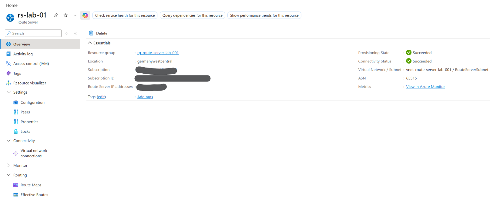
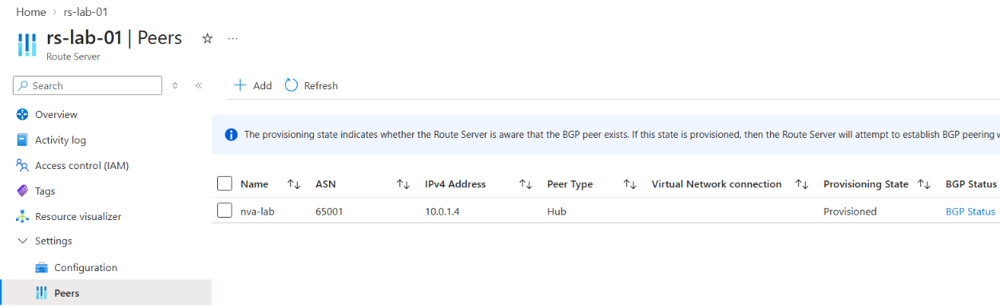
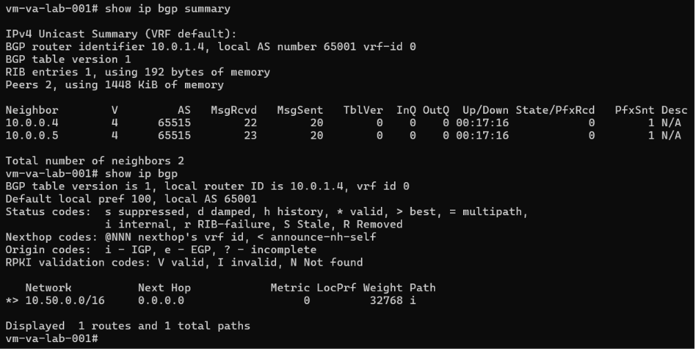
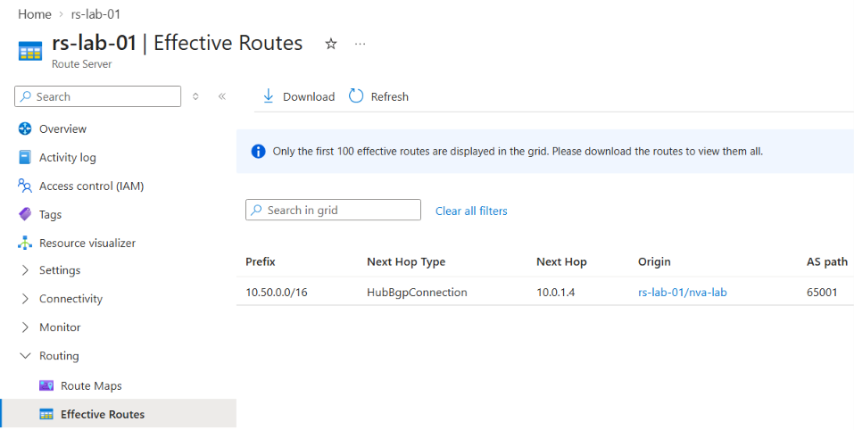

# Azure Route Server

## Overview

Azure Route Server is a managed Azure service that enables dynamic route exchange between Azure and BGP-capable network appliances.

Instead of maintaining routing information exclusively through static routes and User Defined Routes (UDRs), Azure Route Server can use **Border Gateway Protocol (BGP)** to dynamically learn and exchange routes.

A common use case is the integration of **Network Virtual Appliances (NVAs)** such as third-party routers or firewalls.

The important architectural distinction is:

> Azure Route Server exchanges routing information. It does not forward the actual application traffic.

The Route Server therefore operates primarily as part of the routing control plane. The actual traffic follows the learned route and is forwarded through the corresponding next hop, such as an NVA.

---

## Architecture

A simplified architecture looks like this:

```text
Azure Virtual Network
│
├── RouteServerSubnet
│   │
│   └── Azure Route Server
│       ASN 65515
│       ├── 10.0.0.4
│       └── 10.0.0.5
│
└── NVA Subnet
    │
    └── Linux NVA
        10.0.1.4
        ASN 65001
        │
        └── Advertised network
            10.50.0.0/16
```

In this lab, a Linux virtual machine running **FRRouting (FRR)** was used to simulate a BGP-capable NVA.

The essential routing flow was:

```text
NVA / FRR
    │
    │ advertises 10.50.0.0/16
    │ via BGP
    ▼
Azure Route Server
    │
    │ learns the route
    ▼
Azure Routing
```

The Route Server learns that the network `10.50.0.0/16` can be reached through the NVA at `10.0.1.4`.

---

## Route Server Overview

Azure Route Server is deployed into a dedicated subnet named:

```text
RouteServerSubnet
```

The lab used:

| Component | Value |
|---|---|
| Route Server | `rs-lab-01` |
| Virtual Network | `vnet-route-server-lab-001` |
| Route Server subnet | `RouteServerSubnet` |
| Route Server ASN | `65515` |
| Route Server IP 1 | `10.0.0.4` |
| Route Server IP 2 | `10.0.0.5` |
| NVA IP | `10.0.1.4` |
| NVA ASN | `65001` |

The Azure portal shows the provisioning and connectivity state as well as the Route Server ASN and internal IP addresses.



Azure Route Server uses **ASN 65515**.

Azure provides two Route Server instances for redundancy. Therefore, a BGP-capable NVA should establish BGP peerings with **both Route Server IP addresses**.

---

## BGP in This Architecture

**Border Gateway Protocol (BGP)** allows routers to exchange information about reachable IP networks.

For this lab, the most important concept is simple:

```text
NVA:
"10.50.0.0/16 is reachable through me."

        │
        │ BGP advertisement
        ▼

Azure Route Server:
"10.50.0.0/16 can be reached through 10.0.1.4."
```

This allows routing information to be learned dynamically instead of configuring every route manually.

Dynamic routing becomes particularly useful when environments contain many networks or when routes can change over time.

---

## Autonomous System Numbers

BGP participants are identified by an **Autonomous System Number (ASN)**.

The lab used two different ASNs:

```text
Azure Route Server
ASN 65515

        ↕ BGP

NVA / FRRouting
ASN 65001
```

The NVA used the private ASN:

```text
65001
```

Private ASNs are useful for internal environments and labs where globally unique public ASNs are not required.

---

## Network Virtual Appliance

A Linux VM was used as a simple simulated Network Virtual Appliance.

The NVA was located in a separate subnet and used the IP address:

```text
10.0.1.4
```

FRRouting was installed on the VM to provide BGP functionality.

The BGP daemon (`bgpd`) was enabled so that the Linux VM could establish BGP sessions with Azure Route Server.

Conceptually, the FRR configuration contained:

```text
router bgp 65001

neighbor 10.0.0.4 remote-as 65515
neighbor 10.0.0.5 remote-as 65515
```

This establishes BGP relationships between the NVA and both Route Server instances.

---

## IP Forwarding

BGP route exchange and packet forwarding are two different functions.

BGP tells other routing components:

> Which networks can be reached through this router?

IP forwarding allows the NVA to actually forward packets between networks.

For a real NVA scenario, forwarding therefore needs to be enabled appropriately on both the Azure network interface and the operating system.

This distinction is important:

```text
BGP
↓
exchanges routing information

IP Forwarding
↓
forwards actual packets
```

A working BGP session alone does not automatically make a Linux VM a fully functional router.

---

## Configuring the BGP Peer

The NVA was added as a peer to Azure Route Server with the following configuration:

| Setting | Value |
|---|---|
| Peer name | `nva-lab` |
| ASN | `65001` |
| IPv4 address | `10.0.1.4` |

The Azure portal shows the configured peer and its provisioning state.



The `Provisioned` state indicates that Azure Route Server knows about the configured BGP peer and can attempt to establish the BGP sessions.

The corresponding peer configuration must also exist on the NVA.

---

## Verifying the BGP Sessions

On the FRRouting VM, the BGP sessions can be inspected with:

```bash
show ip bgp summary
```

The lab showed both Azure Route Server neighbors:

```text
10.0.0.4
10.0.0.5
```

Both use remote ASN:

```text
65515
```

The following screenshot also shows the BGP table after the test route was advertised:



This verifies the relationship:

```text
                    BGP
        ┌─────────────────────────┐
        │                         │
10.0.0.4                    10.0.0.5
Route Server                Route Server
ASN 65515                   ASN 65515
        │                         │
        └──────────┬──────────────┘
                   │
                10.0.1.4
                   NVA
                ASN 65001
```

---

## Advertising a Test Route

To verify that Azure Route Server could actually learn a route from the NVA, the following test prefix was used:

```text
10.50.0.0/16
```

This network represented a simulated network behind the NVA.

A local blackhole route was created so that the prefix existed in the Linux routing table. FRRouting could then advertise the network using BGP.

Conceptually:

```text
10.50.0.0/16
      │
      ▼
Linux NVA
      │
      │ BGP advertisement
      ▼
Azure Route Server
```

The FRR BGP configuration advertised the network with:

```text
network 10.50.0.0/16
```

The purpose of the test was not to provide a real workload behind `10.50.0.0/16`, but to verify that dynamic route exchange between the NVA and Azure Route Server worked correctly.

---

## Verifying the BGP Table

The BGP table can be inspected on the NVA using:

```bash
show ip bgp
```

The lab showed:

```text
10.50.0.0/16
```

as a locally advertised BGP route.


At this point, the NVA knows about the prefix and advertises it to its BGP neighbors.

The next step is to verify whether Azure Route Server actually learned it.

---

## Effective Routes

The strongest validation of the lab can be seen under the Route Server **Effective Routes** view.



The following route appeared:

| Property | Value |
|---|---|
| Prefix | `10.50.0.0/16` |
| Next Hop Type | `HubBgpConnection` |
| Next Hop | `10.0.1.4` |
| AS Path | `65001` |

This demonstrates that Azure Route Server successfully learned the prefix from the NVA through BGP.

The important interpretation is:

```text
Destination
10.50.0.0/16

        ↓

Azure Route Server learned:
Next Hop = 10.0.1.4

        ↓

10.0.1.4
NVA
ASN 65001
```

In other words, Azure now has dynamic routing information indicating that:

> `10.50.0.0/16` is reachable through the NVA at `10.0.1.4`.

This was the central validation goal of the lab.

---

## Route Server vs. Static Routing

Without dynamic routing, routes are often configured manually using mechanisms such as User Defined Routes.

A simplified static configuration could look like:

```text
10.50.0.0/16
      ↓
UDR
      ↓
Virtual Appliance
10.0.1.4
```

With BGP and Route Server, the routing information can instead be dynamically advertised:

```text
NVA
10.0.1.4
      │
      │ advertises 10.50.0.0/16
      ▼
Route Server
      │
      ▼
Azure learns the route
```

This reduces the need to manually maintain routing information in architectures where routes are dynamic or where multiple BGP-capable network appliances participate in the routing design.

For small Azure environments with only a few stable routes, static routing may still be sufficient.

---

## Route Server and Azure VPN Gateway

Azure VPN Gateway can itself use BGP.

For a normal BGP connection between Azure VPN Gateway and an on-premises VPN device, Azure Route Server is therefore **not automatically required**.

A simplified VPN architecture can already look like:

```text
On-Premises Router
       │
       │ BGP
       ▼
Azure VPN Gateway
       │
       ▼
Azure VNet
```

Without BGP, on-premises address prefixes can instead be configured statically through the Azure Local Network Gateway.

Route Server becomes particularly relevant when additional BGP-capable routing components such as NVAs need to exchange routing information with Azure.

---

## Route Server and Azure Firewall

Azure Firewall does not require Azure Route Server simply because it acts as a firewall.

Traditional Azure Firewall architectures commonly use Azure routing and UDRs to steer traffic through the firewall.

For example:

```text
Spoke Subnet
     │
     │ UDR
     ▼
Azure Firewall
```

With third-party NVAs, Route Server can become useful when the appliance supports BGP and dynamic route exchange is part of the architecture.

The important distinction is therefore not:

```text
Azure Firewall vs. Third-Party Firewall
```

but rather:

```text
Static routing vs. dynamic BGP-based routing
```

---

## Lab Validation Flow

The complete lab can be summarized as:

```text
1. Deploy Azure Route Server
            ↓
2. Create RouteServerSubnet
            ↓
3. Deploy Linux NVA
            ↓
4. Enable IP forwarding
            ↓
5. Install and configure FRRouting
            ↓
6. Configure NVA as Route Server peer
            ↓
7. Establish BGP sessions
            ↓
8. Create simulated network 10.50.0.0/16
            ↓
9. Advertise 10.50.0.0/16 through FRR
            ↓
10. Route Server learns the prefix
            ↓
11. Verify 10.50.0.0/16 under Effective Routes
```

The most important technical chain demonstrated by the lab was:

```text
FRRouting / NVA
      │
      │ BGP advertisement
      ▼
Azure Route Server
      │
      │ learns route
      ▼
Azure Routing Information

10.50.0.0/16
via
10.0.1.4
```

---

## Key Takeaways

- Azure Route Server provides managed **BGP-based dynamic route exchange** in Azure.
- It requires a dedicated `RouteServerSubnet`.
- Azure Route Server uses **ASN 65515**.
- A BGP-capable NVA can establish peerings with Azure Route Server.
- The NVA should peer with both Route Server instances.
- In the lab, FRRouting simulated a BGP-capable NVA.
- The NVA used ASN `65001`.
- The NVA advertised the test network `10.50.0.0/16`.
- Azure Route Server successfully learned the route.
- The learned route showed `10.0.1.4` as the next hop and `65001` in the AS path.
- BGP exchanges **routing information**; it does not itself forward application traffic.
- Route Server also does **not** become the data-plane hop for the actual traffic.
- IP forwarding and BGP route exchange are separate concepts.
- Azure VPN Gateway can use BGP without requiring Route Server for a standard VPN BGP scenario.
- Route Server is especially useful when BGP-capable NVAs participate in more complex Azure routing architectures.

The central concept from the lab can be summarized as:

> **The NVA knows and advertises the route → Azure Route Server learns and distributes the routing information → actual traffic follows the resulting route through the appropriate next hop, not through Azure Route Server itself.**
