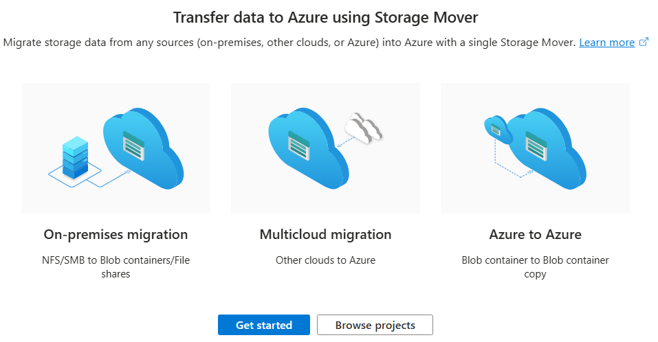
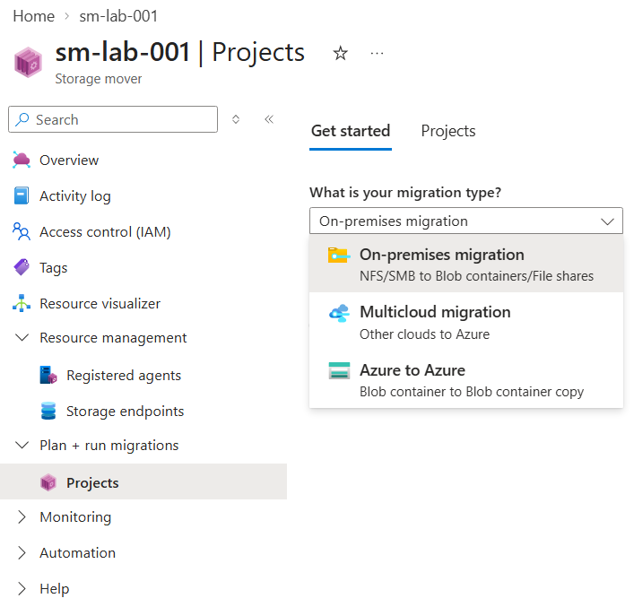
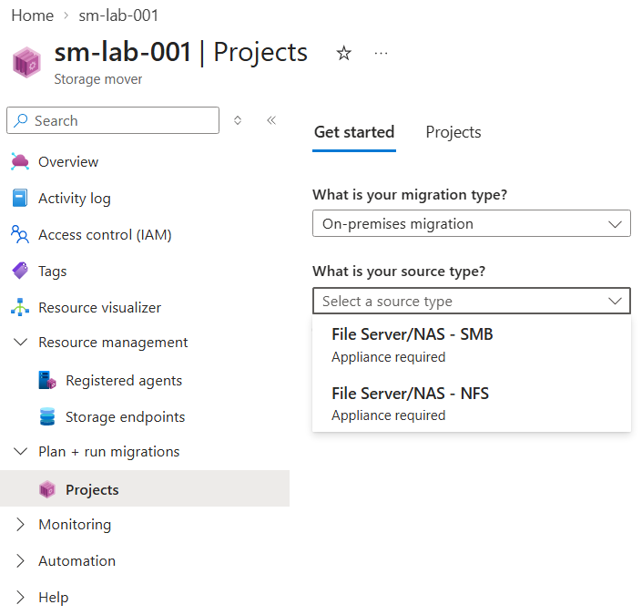
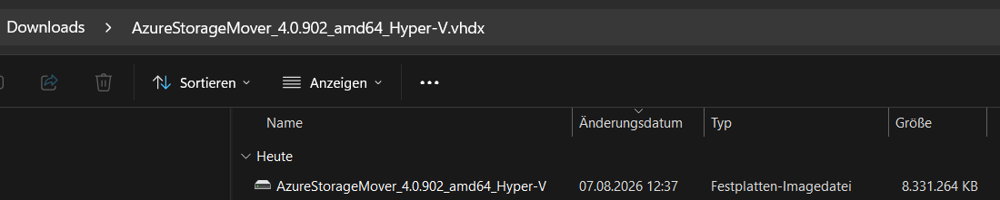
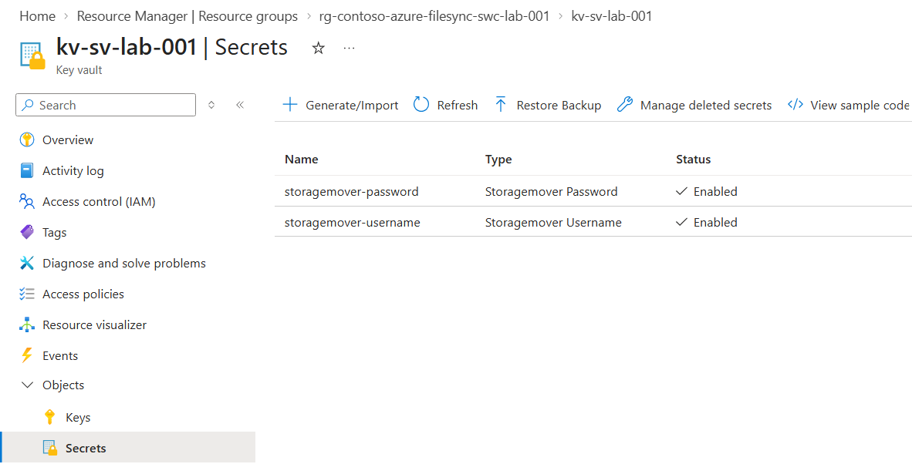
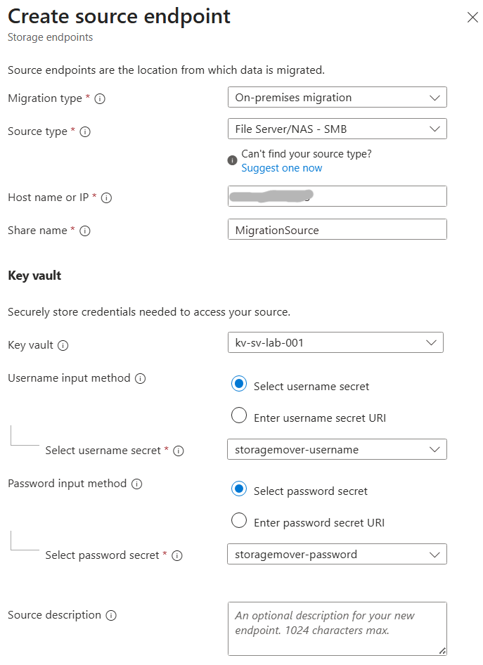
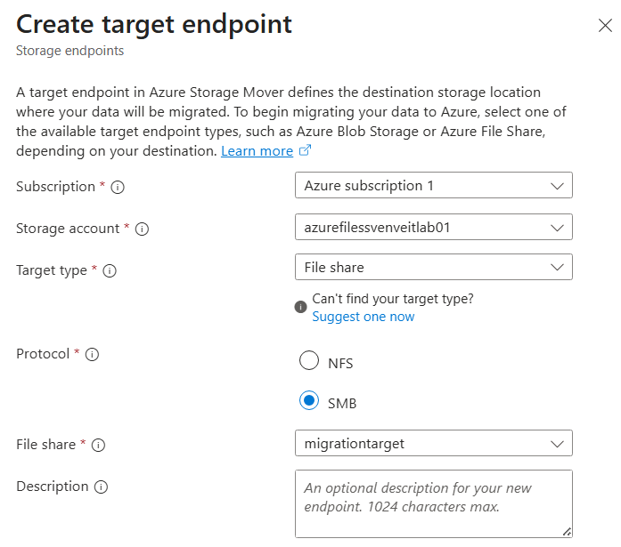

# Azure Storage Mover

## Overview

Azure Storage Mover is a managed Azure service for migrating file and object data to Azure Storage.

It can be used for migration scenarios such as:

- On-premises file servers to Azure
- NAS systems to Azure
- Other cloud platforms to Azure
- Azure-to-Azure storage migrations

For on-premises migrations, Azure Storage Mover uses a migration agent deployed close to the source storage.



---

## Core Components

| Component | Description |
|---|---|
| **Storage Mover** | Azure resource used to manage migrations |
| **Migration Project** | Organizes a migration and its jobs |
| **Source Endpoint** | Defines the source location of the data |
| **Target Endpoint** | Defines the Azure Storage destination |
| **Migration Agent** | Connects the source environment with Azure Storage Mover |
| **Azure Key Vault** | Stores credentials required to access protected source shares |

---

## Lab Scenario

The lab demonstrates an **on-premises SMB file server migration to an Azure File Share**.

```text
On-Premises / Lab Environment
         
     SMB File Share
           │
           │
   Storage Mover Agent
           │
           ▼
   Azure Storage Mover
           │
           ▼
     Azure File Share
```

The migration flow consists of:

1. Deploying the Storage Mover agent
2. Registering the agent with Azure
3. Configuring credentials
4. Creating a source endpoint
5. Creating a target endpoint
6. Creating and running a migration project

---

## 1. Select the Migration Type

Azure Storage Mover supports different migration scenarios.

For this lab, **On-premises migration** is used.



For an on-premises migration, the source can be an SMB or NFS file server or NAS system.



The lab uses:

```text
Migration type: On-premises migration
Source type:    File Server/NAS - SMB
Target:         Azure File Share
```

---

## 2. Deploy the Storage Mover Agent

On-premises migrations require a Storage Mover agent.

For a Hyper-V environment, Microsoft provides the agent as a virtual hard disk image.



The virtual disk is used to deploy the Storage Mover agent as a virtual machine in the source environment.

The agent provides the connection between the local storage environment and Azure Storage Mover.

---

## 3. Configure Source Credentials

If the source SMB share requires authentication, Azure Storage Mover needs credentials to access it.

The credentials can be securely stored as secrets in **Azure Key Vault**.

In this lab, separate secrets were created for:

- SMB username
- SMB password



This avoids storing the credentials directly in the Storage Mover configuration.

---

## 4. Create the Source Endpoint

The Source Endpoint defines where the data to be migrated is located.

For the SMB source, configure:

- Migration type: **On-premises migration**
- Source type: **File Server/NAS - SMB**
- Host name or IP address
- Share name
- Key Vault
- Username secret
- Password secret



The Source Endpoint represents the existing file share from which Storage Mover reads the migration data.

---

## 5. Create the Target Endpoint

The Target Endpoint defines the Azure Storage destination.

In this lab, an **Azure File Share** is used.

Configure:

- Subscription
- Storage Account
- Target type: **File share**
- Protocol: **SMB**
- Azure File Share



The source and target endpoints can then be used by a migration project.

---

## 6. Create and Run the Migration

After the source and target endpoints have been configured, create a migration project in Azure Storage Mover.

The project combines the migration configuration and allows migration jobs to be created and executed.

The basic migration path is:

```text
SMB File Share
      │
      ▼
Storage Mover Agent
      │
      ▼
Source Endpoint
      │
      ▼
Migration Job
      │
      ▼
Target Endpoint
      │
      ▼
Azure File Share
```

After starting the migration, monitor the job until it has completed.

---

## Validation

After the migration has completed, verify that:

- The migration job completed successfully.
- The expected files exist in the Azure File Share.
- The expected directory structure was transferred.
- No migration errors are reported.

For production migrations, additional validation of permissions, metadata and application access may be required depending on the migration scenario.

---

## Storage Mover vs. Azure File Sync

Azure Storage Mover and Azure File Sync solve different problems.

| Azure Storage Mover | Azure File Sync |
|---|---|
| Designed primarily for data migration | Designed for ongoing synchronization |
| Moves existing datasets to Azure Storage | Synchronizes Windows Servers with Azure Files |
| Migration jobs are executed | Continuous synchronization |
| Useful for migration projects | Useful for hybrid file server architectures |

A common distinction is:

> **Storage Mover moves data to Azure. Azure File Sync keeps data synchronized with Azure.**

---

## Key Takeaways

- Azure Storage Mover is a managed service for migrating data to Azure Storage.
- On-premises SMB and NFS sources can be migrated using a Storage Mover agent.
- Source and Target Endpoints define the migration path.
- Credentials for protected SMB shares can be stored securely in Azure Key Vault.
- Azure Files can be used as a migration target.
- Migration projects and jobs control the actual data transfer.
- Storage Mover is intended for migration scenarios and should not be confused with Azure File Sync.
